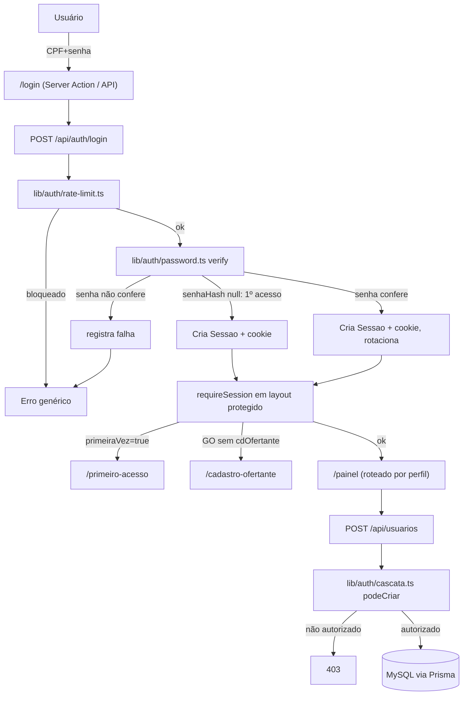

# auth-e-usuarios Design

**Spec**: `.specs/features/auth-e-usuarios/spec.md`
**Status**: Approved

---

## Architecture Overview

Projeto ainda não inicializado (sem `package.json`). Esta feature também escopa o bootstrap: Next.js 16.3.2 (App Router, TypeScript, `src/`), React 19, Prisma Client 7.9.1, Tailwind + shadcn/ui (AD-006).

Ponto de arquitetura decisivo: no Next.js 16 o antigo `middleware.ts` foi renomeado para `proxy.ts` e passou a rodar em Node.js por padrão, mas é documentado como "thin proxy" — não deve fazer chamadas a banco. Consequência: `proxy.ts` só faz um redirect barato por presença de cookie (UX); a validação autoritativa (sessão existe no banco, não expirou, papel, escopo) roda em cada layout/route handler protegido via um helper `requireSession()` compartilhado. Isso também é o que REQ-SEC-14/REQ-AU-06 exigem (reavaliação no servidor a cada request) — a divisão de responsabilidade do Next 16 força exatamente o padrão certo.

**Correção pós-bootstrap (descoberta durante Execute, T2):** Prisma 7 mudou a arquitetura de configuração — `datasource.url` não é mais aceito dentro de `schema.prisma` (erro P1012). A URL de conexão move para um novo `prisma.config.ts`; o `generator` passa de `provider = "prisma-client-js"` para `provider = "prisma-client"` com `output` obrigatório; toda instância de `PrismaClient` passa a exigir um driver adapter explícito (`@prisma/adapter-mysql2` para MySQL), sem fallback. Isso muda o *cabeçalho* técnico (`datasource`/`generator`) de `prisma/schema.prisma` e o caminho de import do client gerado — **os modelos de domínio (`Usuario`, `Sessao`, `Ofertante`, `Verba`, `PreCurso`, `PosCurso`, `AvaliacaoAluno`, enums) não mudam em nada**. Decisão confirmada com o usuário: adotar a arquitetura v7 corretamente (projeto novo, sem legado a proteger) em vez de fixar Prisma 6.x. Ver Tech Decisions.

---

## Code Reuse Analysis

### Existing Components to Leverage

| Component | Location | How to Use |
| --- | --- | --- |
| Modelo `Usuario` (senhaHash, primeiraVez, tentativasFalhas, bloqueadoAte, cdOfertante, criadoPor) | `prisma/schema.prisma:42-75` | Usar como está — nenhum campo novo necessário para esta feature |
| Modelo `Sessao` (id uuid, cpfUsuario, criadaEm, ultimaAtividade, expiraEm) | `prisma/schema.prisma:81-92` | Base da sessão própria (AD-005); `id` uuid v4 como token opaco do cookie |
| Modelo `Ofertante` | `prisma/schema.prisma:98-114` | Cadastro self-service do GO sem ofertante (REQ-AU-09) |
| `.env.example` (`DATABASE_URL`, `SESSION_SECRET`, `NODE_ENV`) | `.env.example` | Copiar para `.env`; `SESSION_SECRET` fica reservado para uso futuro de assinatura (não estritamente necessário com token opaco uuid, ver Tech Decisions) |
| `docker-compose.yml` + `docker/mysql-init/01-grants.sql` | raiz / `docker/` | Já provisiona MySQL 8.4 local — nenhuma mudança |

### Integration Points

| System | Integration Method |
| --- | --- |
| MySQL (docker-compose) | `DATABASE_URL` já apontado para `localhost:3306/spma` |
| Prisma | `npx prisma migrate dev` sobre o schema existente (sem alterações de modelo; cabeçalho `datasource`/`generator` migrado para sintaxe Prisma 7 - ver nota em Architecture Overview) |

---

## Components

### `lib/db/prisma.ts`
- **Purpose**: Singleton do `PrismaClient` (evita esgotar conexões em hot-reload do dev).
- **Location**: `src/lib/db/prisma.ts`
- **Interfaces**: exporta `prisma: PrismaClient`
- **Dependencies**: client gerado pelo Prisma 7 (`provider = "prisma-client"`, caminho de `output` definido em `schema.prisma`) + `@prisma/adapter-mysql2` (driver adapter obrigatório no v7 - `new PrismaClient({ adapter })`, sem fallback)
- **Reuses**: `prisma/schema.prisma`

### `lib/auth/password.ts`
- **Purpose**: Hash e verificação de senha (AD-030: argon2id).
- **Location**: `src/lib/auth/password.ts`
- **Interfaces**:
  - `hashPassword(senha: string): Promise<string>`
  - `verifyPassword(hash: string, senha: string): Promise<boolean>`
- **Dependencies**: `argon2` (argon2id)

### `lib/validation/cpf.ts`
- **Purpose**: Validação de CPF por módulo 11 (REQ-AU-03), compartilhada cliente/servidor (AD-004).
- **Location**: `src/lib/validation/cpf.ts`
- **Interfaces**: `validarCPF(cpf: string): boolean`
- **Dependencies**: nenhuma (puro)

### `lib/validation/schemas/*.ts`
- **Purpose**: Schemas Zod por formulário (login, primeiro acesso, criação de usuário, cadastro de ofertante), usados no cliente (`"use client"` forms) e no servidor (route handlers) — mesma fonte, AD-004.
- **Location**: `src/lib/validation/schemas/{login,primeiro-acesso,usuario,ofertante}.schema.ts`
- **Interfaces**: um `z.object({...})` exportado por arquivo, usando `validarCPF` via `.refine`
- **Dependencies**: `zod`, `lib/validation/cpf.ts`

### `lib/auth/rate-limit.ts`
- **Purpose**: Limite de 5 falhas por conta + bloqueio de 15 min (REQ-AU-11), usando as colunas já existentes em `Usuario`.
- **Location**: `src/lib/auth/rate-limit.ts`
- **Interfaces**:
  - `estaBloqueado(usuario: Usuario): boolean`
  - `registrarFalha(cpf: string): Promise<void>` — incrementa `tentativasFalhas`; ao atingir 5, seta `bloqueadoAte = now + 15min`
  - `resetarTentativas(cpf: string): Promise<void>` — zera contador e `bloqueadoAte` em login bem-sucedido
- **Dependencies**: `lib/db/prisma.ts`
- **Reuses**: `Usuario.tentativasFalhas`, `Usuario.bloqueadoAte` (schema já preparado, AD-028)

### `lib/auth/session.ts`
- **Purpose**: Ciclo de vida da sessão (criação, leitura, rotação, destruição) e emissão de cookie (REQ-AU-12/CA-AU-09).
- **Location**: `src/lib/auth/session.ts`
- **Interfaces**:
  - `criarSessao(cpf: string): Promise<{ id: string; expiraEm: Date }>` — cria linha em `Sessao`, TTL fixo (ver Tech Decisions)
  - `rotacionarSessao(sessaoAnteriorId: string, cpf: string): Promise<{ id: string }>` — destrói a anterior, cria nova (previne fixation)
  - `obterSessao(): Promise<{ usuario: Usuario; sessao: Sessao } | null>` — lê cookie, busca `Sessao` no banco, valida `expiraEm`; usa `cookies()` do `next/headers` (Server Component/Route Handler)
  - `destruirSessao(): Promise<void>` — logout: apaga `Sessao` e limpa cookie
  - `setCookieSessao(id: string, expiraEm: Date): void` — helper de baixo nível (httpOnly, secure, sameSite=lax, expires=expiraEm)
- **Dependencies**: `next/headers`, `lib/db/prisma.ts`
- **Reuses**: modelo `Sessao`

### `lib/auth/cascata.ts`
- **Purpose**: Matriz de autorização de criação em cascata (REQ-AU-05/06) — fonte única usada tanto para filtrar opções na UI quanto para validar no servidor.
- **Location**: `src/lib/auth/cascata.ts`
- **Interfaces**:
  - `TIPOS_PERMITIDOS: Record<TipoUsuario, TipoUsuario[]>` — AM→todos; GT→[GT,VT,GO]; GO→[GO,VO,AL]; VT/VO/AL→[]
  - `podeCriar(criador: TipoUsuario, alvo: TipoUsuario): boolean`
  - `resolverOfertante(criador: Usuario, alvoTipo: TipoUsuario, cdOfertanteInformado?: number): number | null` — GO cria sempre dentro do próprio `cdOfertante` (ignora valor vindo do cliente); AM/GT informam explicitamente; AL/AM/GT/VT ficam `null`

### `lib/auth/guards.ts`
- **Purpose**: Helpers de borda chamados no topo de cada layout/route handler protegido — a autoridade real (REQ-SEC-14), já que `proxy.ts` não pode.
- **Location**: `src/lib/auth/guards.ts`
- **Interfaces**:
  - `requireSession(): Promise<{ usuario: Usuario; sessao: Sessao }>` — `redirect('/login')` (páginas) ou lança erro 401 (API) se sessão inválida/expirada
  - `requirePrimeiroAcessoConcluido(usuario: Usuario): void` — força `/primeiro-acesso` enquanto `primeiraVez === true`
  - `requireOfertanteVinculado(usuario: Usuario): void` — força `/cadastro-ofertante` enquanto `tipo === 'GO' && cdOfertante === null` (REQ-AU-09)
- **Dependencies**: `lib/auth/session.ts`

### `proxy.ts` (raiz do projeto, Next.js 16)
- **Purpose**: Redirect leve por presença de cookie — só UX, não autoridade (ver Architecture Overview).
- **Location**: `src/proxy.ts`
- **Interfaces**: `export function proxy(request: NextRequest)`, `matcher` cobrindo o grupo de rotas protegido
- **Dependencies**: nenhuma chamada a banco

### Rotas de API
- `POST /api/auth/login` — `src/app/api/auth/login/route.ts`: valida schema, checa `estaBloqueado`, verifica senha (ou detecta 1º acesso), cria sessão, seta cookie
- `POST /api/auth/primeiro-acesso` — define `senhaHash`, `primeiraVez=false`, mantém/renova sessão
- `POST /api/auth/logout` — `destruirSessao()`
- `POST /api/usuarios` — `requireSession()` + `podeCriar()` + `resolverOfertante()`; 403 se não autorizado; grava `criadoPor`/`dataCriacao`
- `POST /api/ofertantes` — `requireSession()`; só GO com `cdOfertante === null` (auto-cadastro); grava `cdOfertante` no usuário

### Páginas (App Router)
- `src/app/(public)/login/page.tsx` — formulário CPF+senha (shadcn `Form`/`Input`)
- `src/app/(protegido)/layout.tsx` — chama `requireSession()`, `requirePrimeiroAcessoConcluido()`, `requireOfertanteVinculado()` nessa ordem
- `src/app/(protegido)/primeiro-acesso/page.tsx`
- `src/app/(protegido)/cadastro-ofertante/page.tsx`
- `src/app/(protegido)/painel/page.tsx` — landing pós-login, conteúdo mínimo por perfil (REQ-AU-10); base para as próximas features
- `src/app/(protegido)/usuarios/novo/page.tsx` — formulário de criação em cascata, opções filtradas por `TIPOS_PERMITIDOS[usuarioLogado.tipo]`

### `prisma/seed.ts`
- **Purpose**: Semeia o primeiro AM (README passo 5) — `senhaHash: null`, `primeiraVez: true`, para entrar pelo fluxo normal de 1º acesso.
- **Location**: `prisma/seed.ts`

---

## Data Models

Nenhum modelo novo. `Usuario`, `Sessao`, `Ofertante` já existem em `prisma/schema.prisma` e cobrem todos os requisitos desta feature — ver Code Reuse Analysis.

---

## Error Handling Strategy

| Error Scenario | Handling | User Impact |
| --- | --- | --- |
| CPF inexistente ou senha errada | Resposta idêntica (REQ-AU-04): mesmo corpo/código, mesma mensagem genérica | "CPF ou senha inválidos" |
| Conta bloqueada (5 falhas) | Mesma mensagem genérica acima (não revela bloqueio especificamente) até expirar `bloqueadoAte` | Indistinguível de senha errada |
| CPF com dígito verificador inválido | Zod `.refine` rejeita antes de tocar o banco | "CPF inválido" (mensagem específica — não é enumeração de conta) |
| Cascata não autorizada (REQ-AU-06) | `podeCriar()` retorna `false` → HTTP 403 | "Você não tem permissão para criar este tipo de usuário" |
| Sessão ausente/expirada em rota protegida | `requireSession()`: `redirect('/login')` (página) / 401 (API) | Volta para login |
| GO sem Ofertante tentando acessar outra rota protegida | `requireOfertanteVinculado()` força redirect | Preso em `/cadastro-ofertante` até cadastrar |

---

## Risks & Concerns

| Concern | Location (file:line) | Impact | Mitigation |
| --- | --- | --- | --- |
| `proxy.ts` (Next 16) não pode validar sessão contra o banco (limitação documentada da plataforma) | `src/proxy.ts` (novo) | Se toda a lógica de auth fosse posta ali, quebraria silenciosamente ou ficaria sem checagem real | `proxy.ts` só faz redirect por presença de cookie; `requireSession()` em cada layout/route handler é a autoridade real — decisão já refletida nos Componentes acima |
| 1º acesso identificado só por CPF, sem segunda verificação (AD-010 descarta senha temporária por e-mail/SMS) | `lib/auth/session.ts` (fluxo de login quando `senhaHash` é null) | Quem souber o CPF de um usuário recém-criado (ainda não fez 1º acesso) pode iniciar a definição de senha dele antes do dono legítimo | Aceito por decisão do cliente (AD-010); fora do escopo desta feature mitigar tecnicamente (dependeria de e-mail/SMS, explicitamente descartado). Registrado aqui para rastreabilidade, não como pendência a resolver agora |
| TTL de sessão fixo precisa de um valor concreto porque `Sessao.expiraEm` é `NOT NULL`, mas a política formal de expiração por inatividade é REQ-SEC-09 (feature `seguranca-transversal`, ainda não implementada) | `lib/auth/session.ts` | Escolher um número sem respaldo de spec | TTL fixo de 60 min como placeholder documentado (constante única, fácil de trocar); refresh por atividade (sliding window) fica para `seguranca-transversal` — não é reimplementação, é extensão do mesmo helper |
| Rate limiting nesta feature é só por conta (REQ-AU-11); limite por IP (REQ-SEC-03) é escopo de `seguranca-transversal` | `lib/auth/rate-limit.ts` | Ataque distribuído por CPFs diferentes do mesmo IP não é mitigado ainda | Fora do escopo das ACs desta feature (nenhuma CA-AU-* cobra IP); `seguranca-transversal` adiciona sem alterar a interface pública de `rate-limit.ts` |
| CSRF, headers de segurança, erro genérico+correlação, mascaramento de CPF em log (REQ-SEC-11/12/15/16) não fazem parte desta feature | várias rotas novas de API | Rotas ficam funcionalmente corretas mas sem essas camadas até a próxima feature | Intencional — `seguranca-transversal` é a próxima feature no README e cobre exatamente isso; não há CA-AU-* que exija CSRF/headers |

---

## Tech Decisions

| Decision | Choice | Rationale |
| --- | --- | --- |
| Biblioteca de UI (AD-006) | shadcn/ui + Tailwind | Decisão do usuário nesta sessão de Design — ver `.specs/STATE.md` AD-006 atualizado |
| Hash de senha | `argon2` (argon2id) | Primeira opção listada em AD-030; nativo, sem custo de decisão adicional |
| Versões-alvo do scaffold | Next.js 16.3.2, React 19.2.8, Prisma Client 7.9.1 | Últimas estáveis no npm registry no momento do Design (verificado, não presumido) |
| Token de sessão | uuid v4 opaco (`Sessao.id`, `@default(uuid())`), sem JWT/assinatura | 122 bits de entropia é suficiente como identificador não-adivinhável; casa com "sessão própria" (AD-005) e com o modelo `Sessao` já existente — evita depender de `SESSION_SECRET` nesta feature |
| Roteamento protegido | `proxy.ts` (Next 16) só redirect por cookie; autoridade em `requireSession()` por rota | Limitação documentada do Next 16 (proxy não deve tocar banco) força exatamente o padrão que REQ-SEC-14 já pedia |
| TTL de sessão | 60 minutos fixo, sem sliding window | Placeholder necessário (campo NOT NULL); política formal de inatividade é REQ-SEC-09, escopo de `seguranca-transversal` |
| Escopo de Ofertante na criação de usuário | Servidor sempre resolve `cdOfertante`; nunca confia no valor enviado pelo cliente quando o criador é GO | Único jeito de REQ-AU-08 valer mesmo com cliente adulterado (mesmo espírito de REQ-SEC-14) |
| Configuração do Prisma 7 | Adotar a arquitetura nova (`prisma.config.ts` com a `DATABASE_URL`, `generator` com `provider = "prisma-client"` + `output`, `@prisma/adapter-mysql2` em todo `PrismaClient`) em vez de fixar Prisma 6.x | Decisão confirmada com o usuário durante Execute (T2 bloqueou nisso): projeto novo sem legado, custo é só de configuração/tooling — os modelos de domínio em `schema.prisma` não mudam. Fixar 6.x deixaria o projeto desatualizado desde o dia 1 e adiaria uma migração inevitável. Achado de `npm audit` (prototype pollution antiga, CVE-2022-24802, via `deepmerge-ts` transitivo em `@prisma/config`) afeta igualmente as duas opções (range 6.13-7.10) e é dev-time/build-time, não exposto a input não confiável em produção — não é um diferencial entre as opções |

