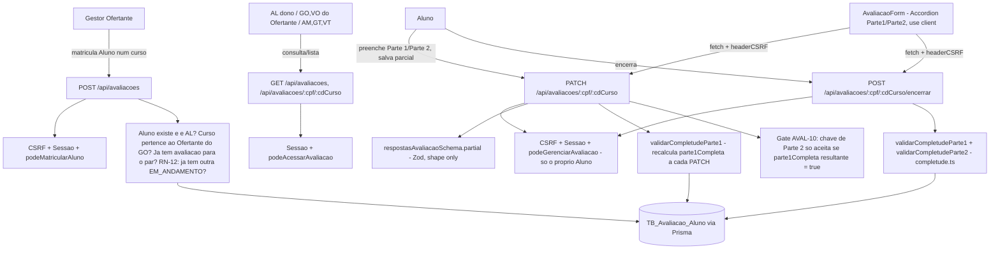

# avaliacao-aluno Design

**Spec**: `.specs/features/avaliacao-aluno/spec.md`
**Status**: Approved

---

## Approach Exploration

### 1. Rota da API para um recurso de chave composta (CPF + CD_Curso)

| Approach | Trade-off |
|---|---|
| **A - Coleção de topo `/api/avaliacoes`, item em `/api/avaliacoes/[cpf]/[cdCurso]` (Recomendada)** | Espelha `/api/pre-cursos`/`/api/pos-cursos` já existentes (mesmo Route Handler, mesma ordem RH→CSRF→Sessão→Guard). A chave composta vira dois segmentos de rota, sem inventar um identificador sintético que o domínio não tem. |
| B - `/api/alunos/[cpf]/avaliacoes/[cdCurso]` | Comunica a posse "aluno → suas avaliações" mais explicitamente, mas não existe hoje uma coleção `/api/alunos/**` no projeto (Usuário é gerido só via cascata em `auth-e-usuarios`, sem CRUD de leitura próprio) — criaria uma rota-mãe só para aninhar esta, sem ganho sobre a Approach A. |

**Decisão:** Approach A, mesmo raciocínio já registrado em `formulario-pos-curso` (Design, "Approach Exploration"). Telas em `/avaliacoes/**`, seção própria.

### 2. Modelagem da FORMA (Zod) e da completude condicional em dois níveis

O documento fonte impõe dois gates empilhados: `parte1Completa` bloqueia toda a Parte 2 (AD-023), e dentro da Parte 2 já liberada, `avalParticipConcluiuCurso` decide se as outras 22 chaves são exigidas (AVAL-12/13). Isso é estruturalmente diferente do Pré-Curso/Pós-Curso, onde a maioria das chaves é sempre-obrigatória e só um punhado é condicional.

| Approach | Trade-off |
|---|---|
| **A - Schema único com todas as 44 chaves `.optional()`; obrigatoriedade 100% delegada a duas funções de completude puras (Recomendada)** | A FORMA (tipo de cada campo) continua validada a cada PATCH; "é obrigatório AGORA" nunca vive no schema Zod, só em `completude.ts`. Evita replicar o problema já registrado como lição (`.specs/LESSONS.md`, L-016): aqui a maioria da Parte 2 é condicional, não a minoria, então o padrão "schema com a maioria required + `.optional()` nos poucos condicionais" (usado no Pré-Curso/Pós-Curso) inverteria a proporção e ficaria mais confuso de ler do que o inverso. |
| B - Reaproveitar o padrão exato do Pré-Curso (schema com a maioria `required`, só os condicionais `.optional()`, encadeando duas `.superRefine`) | Sofre o mesmo problema que a lição L-016 documentou (Zod pula `superRefine` encadeado quando o schema base já tem qualquer issue) — e aqui o "schema base" teria 22 campos required que na prática quase nunca estão preenchidos enquanto `Concluiu="Não"`, tornando a lista de pendências errada na maior parte do tempo de uso real. |

**Decisão:** Approach A. `completude.ts` ganha duas funções: `validarCompletudeParte1` (recomputada a CADA PATCH, decide `parte1Completa`) e `validarCompletudeParte2` (chamada só no encerramento, aplica o gate de `avalParticipConcluiuCurso`). Nenhuma delas encadeia `.superRefine` no schema base - mesma técnica já usada em `formulario-pos-curso` desde o Design (que já aplicou essa lição preventivamente).

---

## Architecture Overview

Mesma arquitetura monolítica Next.js App Router (AD-002): Route Handlers em `src/app/api/avaliacoes/**`, Server Components para leitura/guarda de sessão, um Client Component para o formulário (2 seções: Parte 1 sempre editável pelo Aluno, Parte 2 desabilitada até `parte1Completa=true`). `AvaliacaoAluno.respostas` é `Json?` (já existe no schema, AD-034) - a FORMA é autoridade do Zod, a OBRIGATORIEDADE é autoridade de `completude.ts`.

Diferença estrutural chave frente a Pré-Curso/Pós-Curso: (1) chave é composta (CPF+CD_Curso), não um único id autoincremento; (2) quem GRAVA respostas é uma pessoa diferente de quem CRIA o registro (GO matricula, Aluno preenche) - duas autoridades de escrita distintas sobre o mesmo recurso, nenhuma feature anterior teve esse formato; (3) `parte1Completa` é um flag persistido (não recalculado sob demanda) porque o gate de escrita da Parte 2 precisa dele ANTES de decidir se aceita o PATCH, e recalcular via leitura completa do JSON a cada PATCH seria equivalente, então persistir só evita reprocessar o histórico age depois.



---

## Code Reuse Analysis

### Existing Components to Leverage

| Component | Location | How to Use |
|---|---|---|
| `podeGerenciarPreCurso` | `src/lib/auth/guards.ts` | Reexportado como `podeMatricularAluno` (alias) - a autorização de criação da matrícula é idêntica (só o GO vinculado ao Ofertante-alvo, `cdOfertante` vindo do `PreCurso`/curso informado). Mesmo padrão de alias já usado por `podeGerenciarPosCurso`. |
| `podeAcessarOfertante` | `src/lib/auth/guards.ts` | Componente de `podeAcessarAvaliacao` (nova função) para a parte "GO/VO/AM/GT/VT" do escopo de leitura (REQ AVAL-21/22). |
| `comTratamentoDeErro` | `src/lib/errors/api-error.ts` | Envolve todo Route Handler novo. |
| `verificarCSRF` / `headerCSRF` | `src/lib/security/csrf.ts` / `csrf-client.ts` | Toda mutação (`POST`/`PATCH`), mesma ordem RH→CSRF→Sessão→Guard. |
| `obterSessao` | `src/lib/auth/session.ts` | Autenticação em toda rota de API. |
| `Accordion`/`RadioGroup`/`Checkbox`/`Select`/`Textarea`, `Field*`, `Input`, `Button`, `Card` | `src/components/ui/*` | Já existem (T4 de `formulario-pre-curso`) - nenhum componente shadcn novo; os campos usam os mesmos 5 tipos de controle. |
| `OPCOES_UF` | `src/lib/validation/schemas/pre-curso.schema.ts` | Reexportado/importado direto para `avalPessoalEstado` - evita duplicar a lista de 27 UFs. |
| Padrão de renderização orientado a metadados (`BLOCOS`/`renderCampo`) | `src/app/(protegido)/pre-cursos/[id]/PreCursoForm.tsx`, `pos-cursos/[cdCurso]/PosCursoForm.tsx` | Mesmo padrão em `AvaliacaoForm.tsx`, com uma tabela de blocos por Parte (Parte 1 sempre habilitada, Parte 2 com `disabled` controlado por `parte1Completa`). |
| Padrão de schema + completude como função pura (sem `.superRefine` encadeado) | `src/lib/pos-curso/completude.ts` | Mesma técnica (funções puras somando pendências), adaptada para dois níveis de gate em vez de um - ver Approach Exploration §2. |

### Integration Points

| System | Integration Method |
|---|---|
| `TB_Avaliacao_Aluno` (model `AvaliacaoAluno`) | Já existe no schema (`cpf`+`cdCurso` PK composta, `status`, `parte1Completa`, `respostas Json?`, `dataCriacao`, `dataEncerramento`). Nenhuma migration nesta feature. |
| `TB_Usuario` (model `Usuario`, `tipo=AL`) | Consultada na criação da matrícula (`findUnique({ where: { cpf } })`) para confirmar existência e `tipo=AL` (AVAL-02, edge case 404). Nenhuma alteração no model. |
| `TB_Pre_Curso` (model `PreCurso`) | Consultada em toda rota via `include: { curso: true }` (nome da relação no schema) para obter `cdOfertante` (autorização de matrícula/leitura). Nenhuma alteração no model. |

---

## Components

### `src/lib/validation/schemas/avaliacao.schema.ts`

- **Purpose**: Fonte única de verdade da FORMA das 44 chaves (AD-004) - usada pelo servidor (PATCH) e pela UI para montar `Select`/`RadioGroup`/checkbox groups. Todas as chaves são `.optional()` no schema (ver Approach Exploration §2) - a obrigatoriedade condicional é 100% responsabilidade de `completude.ts`.
- **Location**: `src/lib/validation/schemas/avaliacao.schema.ts`
- **Interfaces**:
  - `matricularAlunoSchema: ZodObject` - `{ cpf: string, cdCurso: number }` (AVAL-01), reusa o validador de CPF (módulo 11) já existente em `src/lib/validation/cpf.ts`.
  - `respostasAvaliacaoSchema: ZodObject` - as 44 chaves do Dicionário de Campos (spec.md), todas `.optional()`.
  - `respostasAvaliacaoParcialSchema` - alias do schema acima (já totalmente opcional; exportado com esse nome só para manter a simetria de nomes com `pre-curso.schema.ts`/`pos-curso.schema.ts` nos call sites do PATCH).
  - Constantes de opções exportadas por campo (`OPCOES_GENERO`, `OPCOES_FAIXA_ETARIA`, `OPCOES_ESCOLARIDADE`, `OPCOES_RACA_ETNIA`, ... - uma por campo de seleção do Dicionário de Campos), reexportando `OPCOES_UF` de `pre-curso.schema.ts` para `avalPessoalEstado`.
  - `CHAVES_PARTE_1: readonly string[]` - as 19 chaves da Parte 1 (usado pelo Route Handler do PATCH para classificar cada chave recebida como Parte 1 ou Parte 2 - AVAL-10).
  - `escalaAvaliacaoCurso: ZodNumber` - `z.number().int().min(1).max(5)` (AD-020), aplicado aos 8 campos de "Avaliação do Curso".
- **Dependências**: `zod`, `validarCPF` (`src/lib/validation/cpf.ts`, reuso - AD-011).
- **Reuses**: mesmo padrão de arquivo de `pre-curso.schema.ts`/`pos-curso.schema.ts`.

### `src/lib/avaliacao/completude.ts`

- **Purpose**: Decide (1) o valor de `parte1Completa` a cada PATCH (AVAL-08), e (2) se a avaliação pode ser encerrada (AVAL-15/16), aplicando o gate de `avalParticipConcluiuCurso` (AVAL-12/13).
- **Location**: `src/lib/avaliacao/completude.ts`
- **Interfaces**:
  - `validarCompletudeParte1(respostas: unknown): { completo: boolean; pendentes: string[] }` - roda um schema dedicado das 17 chaves sempre-obrigatórias de Parte 1 (as 19 chaves menos os 2 condicionais) via `.safeParse`, mais uma função pura para os 2 condicionais (`avalProfissAtividadeEspecifica` se `avalProfissAtuaTurismo="Sim"`; `avalExperienciaTipoCursoAnterior` se `avalExperienciaCursoAnterior="Sim"`), unindo os dois conjuntos de pendências - mesma técnica de `pos-curso/completude.ts`.
  - `validarCompletudeParte2(respostas: unknown): { completo: boolean; pendentes: string[] }` - se `avalParticipConcluiuCurso` ausente/inválido, pendente sozinho; se `="Não"`, exige só `avalParticipMotivoNaoConclusao` (as 22 chaves restantes não entram em `pendentes`); se `="Sim"`, roda um schema dedicado das 22 chaves via `.safeParse`. `avalGeralComentariosFinais` nunca entra nesse schema (sempre opcional).
  - `validarCompletudeAvaliacao(respostas: unknown): { completo: boolean; pendentes: string[] }` - união de `validarCompletudeParte1` + `validarCompletudeParte2`, usada só no encerramento (AVAL-15/16).
- **Dependências**: `respostasAvaliacaoSchema` (schemas dedicados internos, não o schema totalmente opcional).
- **Reuses**: a técnica (funções puras, sem `.superRefine` encadeado) já validada em `src/lib/pos-curso/completude.ts`.

### `src/lib/auth/guards.ts` (extensão)

- **Purpose**: Três autoridades novas para este recurso - nenhuma reaproveita 1:1 uma função existente, porque a matrícula tem dono (Ofertante) mas a escrita de respostas tem dono diferente (a própria pessoa).
- **Location**: `src/lib/auth/guards.ts` (arquivo existente)
- **Interfaces**:
  - `export const podeMatricularAluno = podeGerenciarPreCurso;` - alias, mesma regra (GO do Ofertante-alvo).
  - `podeGerenciarAvaliacao(usuario: { tipo: TipoUsuario; cpf: string }, cpfAvaliacao: string): boolean` - `usuario.tipo === "AL" && usuario.cpf === cpfAvaliacao` (AVAL-09/18). Primeira guarda de identidade pura do projeto - nenhuma feature anterior tinha "só o próprio dono, não um perfil de gestão" como regra de escrita.
  - `podeAcessarAvaliacao(usuario: { tipo: TipoUsuario; cpf: string; cdOfertante: number | null }, alvo: { cpfAluno: string; cdOfertante: number }): boolean` - `AL` só a própria (`usuario.cpf === alvo.cpfAluno`); `GO`/`VO` via `podeAcessarOfertante(usuario, alvo.cdOfertante)`; `AM`/`GT`/`VT` sempre `true` (AVAL-20/21/23).
- **Dependências**: `podeAcessarOfertante` (reuso interno, chamado por `podeAcessarAvaliacao`).
- **Reuses**: `podeGerenciarPreCurso`, `podeAcessarOfertante`.

### `src/app/api/avaliacoes/route.ts`

- **Purpose**: `POST` matricula (AVAL-01 a 06), `GET` lista escopada (AVAL-22).
- **Location**: `src/app/api/avaliacoes/route.ts`
- **Interfaces**: `POST`, `GET`.
- **Dependências**: `matricularAlunoSchema`, `podeMatricularAluno`.
- **Reuses**: estrutura 1:1 de `src/app/api/pos-cursos/route.ts`. `POST` busca o `Usuario` pelo CPF (404 se não existir, 400 se existir mas `tipo≠AL`), busca o `PreCurso` pelo `cdCurso` (404 se não existir), confere `podeMatricularAluno(sessao.usuario, curso.cdOfertante)` (403), confere duplicidade do par via `findUnique` (409, mesmo padrão de "checar antes do create" já usado em `pos-cursos`), confere RN-12 via `findFirst({ where: { cpf, status: "EM_ANDAMENTO" } })` (409 se encontrado). `GET` filtra por `curso: { cdOfertante }` (GO/VO), sem filtro (AM/GT/VT), ou `{ cpf: sessao.usuario.cpf }` (AL).

### `src/app/api/avaliacoes/[cpf]/[cdCurso]/route.ts`

- **Purpose**: `GET` consulta escopada (AVAL-20/21/23), `PATCH` grava respostas parciais com os dois gates (AVAL-07/08/09/10/11).
- **Location**: `src/app/api/avaliacoes/[cpf]/[cdCurso]/route.ts`
- **Interfaces**: `GET`, `PATCH`.
- **Dependências**: `respostasAvaliacaoParcialSchema`, `CHAVES_PARTE_1`, `validarCompletudeParte1`, `podeAcessarAvaliacao` (GET), `podeGerenciarAvaliacao` (PATCH). Toda consulta usa `prisma.avaliacaoAluno.findUnique({ where: { cpf_cdCurso: { cpf, cdCurso } }, include: { curso: true } })` para ter `cdOfertante` disponível.
- **PATCH - ordem de checagem**: (1) 404 se não existe; (2) 403 se `!podeGerenciarAvaliacao`; (3) 409 se `status=ENCERRADO`; (4) valida FORMA do corpo (`respostasAvaliacaoParcialSchema`, 400); (5) mescla `existente.respostas` + corpo em memória; (6) roda `validarCompletudeParte1` no estado mesclado → `parte1CompletaResultante`; (7) se o corpo tiver alguma chave fora de `CHAVES_PARTE_1` e `parte1CompletaResultante === false` → 400 (AVAL-10), nada persistido; (8) persiste `respostas=mesclado`, `parte1Completa=parte1CompletaResultante` numa única `update`.
- **Reuses**: estrutura 1:1 de `src/app/api/pos-cursos/[cdCurso]/route.ts`, incluindo o merge raso em memória.

### `src/app/api/avaliacoes/[cpf]/[cdCurso]/encerrar/route.ts`

- **Purpose**: `POST` transição irreversível de status (AVAL-15/16/17/18/19).
- **Location**: `src/app/api/avaliacoes/[cpf]/[cdCurso]/encerrar/route.ts`
- **Interfaces**: `POST`.
- **Dependências**: `validarCompletudeAvaliacao`, `podeGerenciarAvaliacao`.
- **Reuses**: mesma ordem RH→CSRF→Sessão→Guard e mesmo formato de `src/app/api/pos-cursos/[cdCurso]/encerrar/route.ts`.

### `src/app/(protegido)/avaliacoes/**` (Server Components + Client Components)

- **Purpose**: `page.tsx` (listagem escopada por perfil - Aluno vê a própria, GO/VO por Ofertante, AM/GT/VT nacional); `novo/page.tsx` + `MatricularAlunoForm.tsx` (GO informa CPF do Aluno + escolhe um curso próprio - form pequeno, reuso do padrão de `pos-cursos/novo`); `[cpf]/[cdCurso]/page.tsx` + `AvaliacaoForm.tsx` (o formulário de 44 campos, 2 Accordions - Parte 1 e Parte 2, a segunda com `disabled` até `parte1Completa`).
- **Location**: `src/app/(protegido)/avaliacoes/`
- **Interfaces**: nenhuma pública além das páginas Next.js; `AvaliacaoForm` recebe `{ cpf, cdCurso, status, parte1Completa, respostasIniciais, podeEditar }` como props (mesmo contrato de `PosCursoForm`, com `parte1Completa` a mais).
- **Dependências**: componentes shadcn já existentes (nenhum novo).
- **Reuses**: padrão exato de `pos-cursos/novo/` e `pos-cursos/[cdCurso]/`.

---

## Data Models

### `RespostasAvaliacaoAluno` (forma do JSON em `AvaliacaoAluno.respostas`)

```typescript
// Gerado a partir do Dicionário de Campos em spec.md - 44 chaves, todas
// opcionais no tipo. A obrigatoriedade condicional (Parte 1 sempre; Parte 2
// só quando aplicável) é imposta por completude.ts, não pelo tipo.
interface RespostasAvaliacaoAluno {
  // Parte 1 - Dados Pessoais
  avalPessoalEstado?: string; // OPCOES_UF
  avalPessoalMunicipio?: string;
  avalPessoalGenero?: "Feminino" | "Masculino" | "Não binário" | "Prefiro não informar";
  avalPessoalFaixaEtaria?: string;
  avalPessoalEscolaridade?: string;
  avalPessoalRacaEtnia?: string;
  avalPessoalCondicaoPcd?: "Sim" | "Não";
  // Parte 1 - Situação Profissional
  avalProfissCondicaoTrabalho?: string;
  avalProfissAtuaTurismo?: "Sim" | "Não";
  avalProfissAtividadeEspecifica?: string; // condicional
  avalProfissFaixaRenda?: string;
  // Parte 1 - Experiência
  avalExperienciaTrabalhoPrevio?: "Sim" | "Não";
  avalExperienciaCursoAnterior?: "Sim" | "Não";
  avalExperienciaTipoCursoAnterior?: string; // condicional
  // Parte 1 - Motivação
  avalMotivMotivosParticipacao?: string[]; // 1 a 3
  avalMotivFormaConhecimento?: string;
  // Parte 1 - Expectativas
  avalExpectAtendimento?: string;
  avalExpectEmprego?: string;
  avalExpectRenda?: string;
  // Parte 2 - Participação
  avalParticipConcluiuCurso?: "Sim" | "Não"; // gate
  avalParticipMotivoNaoConclusao?: string[]; // condicional (Não)
  avalParticipPercentualFrequencia?: number; // condicional (Sim), 0-100
  // Parte 2 - Avaliação do Curso (escala 1-5, AD-020, condicional Sim)
  avalCursoDinamicasInclusao?: number;
  avalCursoMaterialDidatico?: number;
  avalCursoConteudo?: number;
  avalCursoClareza?: number;
  avalCursoConhecimentoInstrutores?: number;
  avalCursoOrganizacao?: number;
  avalCursoInfraestruturaBasica?: number;
  avalCursoInfraestruturaSalaAula?: number;
  // Parte 2 - Aprendizado (condicional Sim)
  avalAprendizAmpliacaoConhecimento?: string;
  avalAprendizAtendimentoExpectativas?: string;
  avalAprendizSensacaoPreparo?: string;
  // Parte 2 - Continuidade (condicional Sim)
  avalContinuidadeRetomadaEstudos?: string;
  // Parte 2 - Motivações Pós-Curso (condicional Sim)
  avalMotivacoesPosPercepcoes?: string[];
  // Parte 2 - Oportunidades de Trabalho (condicional Sim)
  avalOportunSituacaoTrabalho?: string;
  avalOportunIntencaoAtuarTurismo?: "Sim" | "Não" | "Ainda não decidi";
  // Parte 2 - Efetivação e Renda (condicional Sim)
  avalEfetivEmprego?: "Sim" | "Não" | "Não se aplica";
  avalEfetivAumentoRenda?: "Sim" | "Não" | "Não se aplica";
  avalEfetivMelhoriaPadraoVida?: "Sim" | "Não" | "Não se aplica";
  // Parte 2 - Avaliação Geral (3 condicionais Sim, 1 sempre opcional)
  avalGeralNota?: number; // 0-10
  avalGeralMelhoriasComunidade?: "Sim" | "Não" | "Não sei avaliar";
  avalGeralRecomendaCurso?: "Sim" | "Não" | "Talvez";
  avalGeralComentariosFinais?: string; // sempre opcional
}
```

**Relationships**: 1:1 com `AvaliacaoAluno.respostas` (coluna `Json?`). `AvaliacaoAluno` tem PK composta (`cpf`, `cdCurso`) e FK para `PreCurso` via `cdCurso` (relação `curso`) - `cdOfertante` sempre obtido via esse relacionamento, nunca coluna própria.

---

## Error Handling Strategy

| Error Scenario | Handling | User Impact |
|---|---|---|
| CPF de matrícula não corresponde a usuário existente | 404 | "Aluno não encontrado" |
| CPF existe mas não é `tipo=AL` (AVAL-02) | 400 | "CPF informado não é de um Aluno" |
| `cdCurso` de matrícula não existe (AVAL-05) | 404 | "Curso não encontrado" |
| `cdCurso` pertence a outro Ofertante (AVAL-05/06) | 403 | "Acesso negado" |
| Par (CPF, cdCurso) já matriculado (AVAL-03) | 409, checado via `findUnique` antes do `create` | "Este aluno já tem avaliação para este curso" |
| Aluno já tem outra avaliação `EM_ANDAMENTO` - RN-12 (AVAL-04) | 409, checado via `findFirst` antes do `create` | "Este aluno já tem uma avaliação em andamento noutro curso" |
| Campo fora de forma no PATCH (AVAL-07) | 400 | Mensagem do campo inválido |
| Chave de Parte 2 enviada com `parte1Completa` resultante = false (AVAL-10) | 400, nada persistido | "Complete a Parte 1 antes de responder a avaliação do curso" |
| Gravação/encerramento por quem não é o próprio Aluno (AVAL-09/18) | 403 | "Acesso negado" |
| Encerramento com pendências (AVAL-16) | 400 com `{ pendentes: string[] }` completo | UI destaca todos os campos faltantes de uma vez |
| Gravação ou encerramento em avaliação já `ENCERRADO` (AVAL-17) | 409, dado não tocado | "Esta avaliação já foi encerrada e não pode mais ser alterada" |
| Leitura/escrita fora do escopo (AVAL-23) | 403 | "Acesso negado" |
| Erro não previsto | `comTratamentoDeErro` - 500 genérico + id de correlação | Mensagem genérica + código de suporte |

---

## Risks & Concerns

| Concern | Location (file:line) | Impact | Mitigation |
|---|---|---|---|
| `AvaliacaoAluno` não tem `cdOfertante` próprio (igual ao `PosCurso`) - todo guard de escopo por Ofertante depende do `include: { curso: true }` | `src/app/api/avaliacoes/**` (a criar) | Esquecer o `include` faria `podeAcessarAvaliacao`/`podeMatricularAluno` sempre `false` para GO/VO (falha fechada, não uma falha de segurança) | Mesma mitigação já usada em `formulario-pos-curso`: e2e cobre 200 no próprio Ofertante E 403 fora dele para cada rota nova - esquecimento do `include` derruba o caminho feliz, não passa silencioso. |
| Recalcular `parte1Completa` a cada PATCH exige ler o estado mesclado inteiro (existente + patch) mesmo quando o PATCH só toca chaves de Parte 2 | `src/app/api/avaliacoes/[cpf]/[cdCurso]/route.ts` (a criar) | Custo extra desprezível (JSON pequeno, mesma leitura que já é feita para o merge raso) - não é um risco de performance real dado o volume esperado (formulário preenchido por 1 pessoa por vez) | Nenhuma mitigação adicional necessária; documentado para não ser "redescoberto" como suposto problema depois. |
| `podeGerenciarAvaliacao` é a primeira guarda de identidade pura do projeto (sem checagem de perfil de gestão) | `src/lib/auth/guards.ts` (extensão) | Se uma feature futura precisar de uma exceção administrativa (ex.: AM corrigir uma avaliação por engano do aluno), essa guarda bloquearia por design - decisão deliberada, não uma lacuna | Nenhuma exceção existe no documento fonte (seção 6.5: "encerra... por meio de um botão específico", ação do próprio aluno) - se surgir esse caso real, é uma nova AD, não um ajuste silencioso desta guarda. |
| RN-12 (uma avaliação `EM_ANDAMENTO` por vez) é checada só na CRIAÇÃO da matrícula (`findFirst` antes do `create`) | `src/app/api/avaliacoes/route.ts` (a criar) | Uma corrida rara (duas matrículas simultâneas para o mesmo Aluno em cursos diferentes) poderia, em teoria, passar as duas checagens antes de qualquer `create` completar | Mesmo nível de proteção que toda checagem `findUnique`-antes-do-`create` já aceito nesta base (`formulario-pos-curso` REQ-PO-02); RN-12 é uma regra de negócio de fluxo humano (matrícula é um ato administrativo pontual do GO), não um caminho de alta concorrência - fora do escopo tratar como corrida crítica. |

---

## Tech Decisions (only non-obvious ones)

| Decision | Choice | Rationale |
|---|---|---|
| Rota da API para chave composta | `/api/avaliacoes/[cpf]/[cdCurso]` (dois segmentos) | Ver Approach Exploration §1 - reflete a PK composta sem inventar identificador sintético. |
| Schema Zod: campos majoritariamente `required` vs majoritariamente `.optional()` | Todas as 44 chaves `.optional()` no schema de FORMA; obrigatoriedade 100% em `completude.ts` | Ver Approach Exploration §2 - inverte o padrão do Pré-Curso/Pós-Curso porque aqui a MAIORIA da Parte 2 (22 de 25 chaves) é condicional, não a minoria. |
| `parte1Completa`: flag persistido vs recalculado sob demanda em toda leitura | Persistido, recalculado a cada PATCH que toca Parte 1 | Já é a modelagem existente no schema (`AvaliacaoAluno.parte1Completa Boolean`, decisão de uma feature anterior - AD-034 nota "Parte1_Completa") - o Design aqui só define QUANDO recalcular (a cada PATCH), não SE persistir. |
| `podeMatricularAluno`: alias vs função nova | Alias de `podeGerenciarPreCurso` | Regra idêntica (GO dono do Ofertante-alvo) - mesmo raciocínio já aceito para `podeGerenciarPosCurso`. |
| `podeGerenciarAvaliacao`: por perfil (ex.: "AL") vs por identidade (CPF da sessão = CPF do registro) | Por identidade (`usuario.cpf === cpfAvaliacao`) | A regra de negócio (seção 6, "preenchido pelo próprio aluno"; seção 3.7, "acionada pelo aluno") é sobre A PESSOA, não sobre O PERFIL - um GO nunca teria `tipo=AL` mesmo por engano, mas checar por identidade é mais preciso e mais barato que checar tipo+cpf redundantemente. |

> Nenhuma decisão desta tabela estabelece um padrão novo para features futuras além do já coberto por AD-004/AD-012/AD-033 (reuso de convenções existentes) - nenhuma AD nova necessária em `STATE.md`.

---

## Tips

- Nenhuma migration Prisma necessária - `TB_Avaliacao_Aluno` já existe no schema desde antes desta feature (nota "AD-018, AD-020, AD-022, AD-023" no schema).
- Nenhum componente shadcn novo.
- `validarCPF` (módulo 11, AD-011) já existe em `src/lib/validation/cpf.ts` - reusar na validação do CPF informado na matrícula, não reimplementar.
