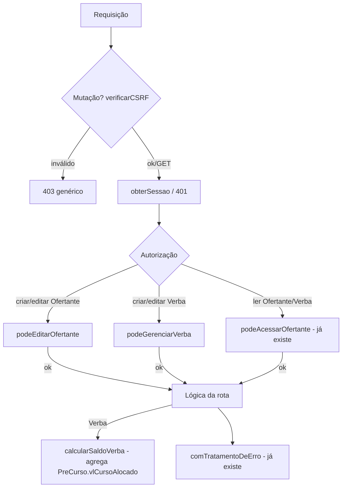

# cadastro-ofertante-verba Design

**Spec**: `.specs/features/cadastro-ofertante-verba/spec.md`
**Status**: Approved

---

## Architecture Overview

`TB_Ofertante` e `TB_Verba` já existem no schema (nenhuma migration nesta feature). O trabalho é inteiramente de API + validação + autorização, reaproveitando os padrões já estabelecidos por `auth-e-usuarios` (cascata, sessão) e `seguranca-transversal` (CSRF, erro genérico, `podeAcessarOfertante`).

---

## Code Reuse Analysis

### Existing Components to Leverage

| Component | Location | How to Use |
|---|---|---|
| `ofertanteSchema` | `src/lib/validation/schemas/ofertante.schema.ts` | Reusado sem alteração para criação (já existe) e para edição (mesmos campos) |
| `podeAcessarOfertante` | `src/lib/auth/guards.ts` | Reusado tal como está para toda leitura de Ofertante/Verba (REQ-OV-05/06/07/10) |
| `verificarCSRF` / `comTratamentoDeErro` | `src/lib/security/csrf.ts`, `src/lib/errors/api-error.ts` | Aplicados a toda rota mutante nova, mesmo padrão de `usuarios/route.ts` |
| `obterSessao` + 401 explícito | `src/lib/auth/session.ts` | Mesmo padrão de todas as rotas de API existentes (não usa `requireSession()`, que redireciona) |
| Padrão de rota existente `POST /api/ofertantes` | `src/app/api/ofertantes/route.ts` | Estendido (não substituído) para aceitar também AM/GT como criadores, além do auto-cadastro do GO já implementado |
| `PreCurso` model (já existe) | `prisma/schema.prisma:156-182` | Usado só para leitura/agregação (`vlCursoAlocado`) no cálculo de saldo - nenhuma escrita nesta feature |

### Integration Points

| System | Integration Method |
|---|---|
| MySQL (Prisma) | Nenhuma migration - `Ofertante`/`Verba`/`PreCurso` já existem. Só novas queries (`findMany`, `aggregate`, `update`). |
| `usuarios/route.ts` (já existe) | Ganha uma checagem de existência do `cdOfertante` antes do `create`, fechando REQ-OV-04 sem alterar o resto do fluxo de cascata. |

---

## Components

### `src/lib/validation/schemas/verba.schema.ts` (novo)

- **Purpose**: Validação de entrada para criação/edição de Verba.
- **Interfaces**: `verbaSchema = z.object({ cdOfertante: z.number().int().positive(), vlVerba: z.number().positive(), dtVerba: z.coerce.date().optional() })`; `edicaoVerbaSchema = z.object({ vlVerba: z.number().positive(), dtVerba: z.coerce.date().optional() })` (sem `cdOfertante` - não se transfere uma verba de ofertante).
- **Reuses**: mesmo estilo de `ofertante.schema.ts`/`usuario.schema.ts`.

### `src/lib/verba/saldo.ts` (novo)

- **Purpose**: Cálculo de saldo e validação de teto (REQ-OV-11/12) - função de serviço reutilizável, sem rota própria obrigatória, consumida pelas rotas de Verba desta feature e (mais tarde) pela rota de criação de curso de `formulario-pre-curso`.
- **Interfaces**:
  - `calcularSaldoVerba(cdVerba: number): Promise<{ valorTotal: Decimal; totalAlocado: Decimal; saldoDisponivel: Decimal }>` - agrega `PreCurso.vlCursoAlocado` por `cdVerba` via `prisma.preCurso.aggregate`.
  - `validarNovoValorTotal(cdVerba: number, novoValorTotal: number): Promise<boolean>` - usado na edição da Verba (REQ-OV-09/CA-OV-14): `novoValorTotal >= totalAlocado`.
- **Dependencies**: `src/lib/db/prisma.ts`.
- **Reuses**: nenhum - peça nova central desta feature.

### `src/lib/auth/guards.ts` (modificado)

- **Purpose**: Duas novas guardas de autorização de escrita, complementares a `podeAcessarOfertante` (que é só de leitura/escopo).
- **Interfaces**:
  - `podeEditarOfertante(usuario: { tipo: TipoUsuario; cdOfertante: number | null }, cdOfertanteAlvo: number): boolean` - AM/GT sempre `true`; GO só `true` se `cdOfertante === cdOfertanteAlvo`; VT/VO/AL sempre `false` (VT e VO leem mas não escrevem - por isso não reusa `podeAcessarOfertante`, que devolve `true` para VT).
  - `podeGerenciarVerba(tipo: TipoUsuario): boolean` - `true` só para AM/GT (o documento fonte, seção 3.4, atribui a criação da Verba ao Gestor Turismo; GO consome a verba mas não a cria/edita - ver Assunções em spec.md).
- **Reuses**: mesmo estilo de função pura de `cascata.ts`/`podeAcessarOfertante`.

### `src/app/api/ofertantes/route.ts` (modificado)

- **Purpose**: Ganha `GET` (listagem escopada, REQ-OV-06) e estende `POST` para aceitar AM/GT como criadores (REQ-OV-01), preservando o auto-cadastro do GO já implementado.
- **Mudança em `POST`**: a checagem atual (`usuario.tipo !== "GO"` → 403) passa a: AM/GT sempre podem criar um Ofertante autônomo (sem vincular a si mesmos - eles não têm `cdOfertante`); GO sem `cdOfertante` continua se auto-cadastrando e se vinculando (comportamento existente, inalterado); GO já vinculado continua recebendo 409; VT/VO/AL continuam recebendo 403.
- **`GET` (novo)**: AM/GT/VT → `prisma.ofertante.findMany()` (todos); GO/VO → `findMany({ where: { cdOfertante: sessao.usuario.cdOfertante } })` (nunca confia em query param do cliente - AD-033).

### `src/app/api/ofertantes/[id]/route.ts` (novo)

- **Purpose**: Consulta e edição de um Ofertante específico (REQ-OV-02/03/05).
- **Interfaces**: `GET` (checa `podeAcessarOfertante`, 403 se fora de escopo, 404 se não existe); `PATCH` (checa `podeEditarOfertante`, valida com `ofertanteSchema`, 403 se não autorizado).

### `src/app/api/verbas/route.ts` (novo)

- **Purpose**: Criação e listagem de Verba (REQ-OV-08/10).
- **Interfaces**: `POST` (checa `podeGerenciarVerba`, valida `verbaSchema`, checa existência do `cdOfertante` antes de criar - CA-OV-09, 400 se não existir); `GET` (mesmo padrão de escopo do `GET /api/ofertantes` - AM/GT/VT veem todas ou filtram por `?cdOfertante=`; GO/VO só o próprio ofertante, ignorando qualquer filtro informado) - cada item da resposta inclui `saldoDisponivel` calculado via `calcularSaldoVerba`.

### `src/app/api/verbas/[id]/route.ts` (novo)

- **Purpose**: Consulta e edição de uma Verba específica (REQ-OV-09/10/11).
- **Interfaces**: `GET` (checa `podeAcessarOfertante` contra o `cdOfertante` da Verba; resposta inclui `saldoDisponivel`); `PATCH` (checa `podeGerenciarVerba`, valida `edicaoVerbaSchema`, chama `validarNovoValorTotal` antes de gravar - 409 se o novo valor for menor que o já alocado, CA-OV-14).

### `src/app/api/usuarios/route.ts` (modificado)

- **Purpose**: Fecha REQ-OV-04/CA-OV-05 - hoje um `cdOfertante` inexistente ao criar um GO/VO só falharia na constraint de FK do MySQL, virando um 500 genérico via `comTratamentoDeErro` (tecnicamente seguro, mas não é o "erro claro" que o critério pede).
- **Mudança**: antes do `prisma.usuario.create`, se `cdOfertante` resolvido não for `null`, checar `prisma.ofertante.findUnique({ where: { cdOfertante } })`; se não existir, `400 { erro: "Ofertante informado não existe" }`.
- **Fora de escopo**: a spec menciona "cria ou atualiza" (REQ-OV-04), mas não existe rota de edição de usuário no código hoje (nenhuma feature construiu isso) - a checagem de existência do Ofertante nesta feature cobre só o caminho de criação, que é o único que existe. SPEC_DEVIATION a documentar no código: se uma rota de edição de usuário for criada no futuro, ela precisa da mesma checagem.

---

## Data Models

Nenhum novo model. `Ofertante`, `Verba` e `PreCurso` (usado só para leitura agregada) já existem em `prisma/schema.prisma:112-182`, desenhados antecipadamente. Nenhuma migration nesta feature.

---

## Error Handling Strategy

| Error Scenario | Handling | User Impact |
|---|---|---|
| Ofertante inexistente ao criar usuário GO/VO | 400 antes do `create`, evita 500 genérico | Mensagem clara identificando o problema, não um erro de correlação sem contexto |
| Ofertante inexistente ao criar Verba | 400 antes do `create` | Mesma clareza |
| Edição de Verba reduzindo abaixo do já alocado | 409 (conflito com estado atual, mesmo padrão de "Ofertante já vinculado" em `auth-e-usuarios`) | Mensagem indica o valor mínimo permitido (o já alocado) |
| Alocação de curso acima do saldo (consumida por `formulario-pre-curso`, função pronta aqui) | `validarAlocacao`/`calcularSaldoVerba` devolve o saldo disponível para a rota chamadora decidir o status HTTP | N/A nesta feature - documentado para a próxima |
| Leitura/edição fora de escopo | 403 via `podeAcessarOfertante`/`podeEditarOfertante`/`podeGerenciarVerba` | Mensagem genérica, mesmo padrão de `usuarios/route.ts` |

---

## Risks & Concerns

| Concern | Location (file:line) | Impact | Mitigation |
|---|---|---|---|
| REQ-OV-12 (validação de teto) não tem hoje nenhuma rota real de criação de curso para ser exercitada de ponta a ponta | `src/lib/verba/saldo.ts` (novo) | O critério fica coberto em nível de serviço (integration test direto contra `PreCurso` via Prisma), não end-to-end pela UI | `calcularSaldoVerba`/`validarNovoValorTotal` implementadas e testadas agora; task explícita documentando que `formulario-pre-curso` **deve** chamar `calcularSaldoVerba` antes de gravar `vlCursoAlocado` e usar o mesmo saldo para decidir aceitar/rejeitar |
| `usuarios/route.ts` já é uma rota de `auth-e-usuarios`, verificada e fechada (`validation.md` = PASS) - modificá-la reabre uma superfície já validada | `src/app/api/usuarios/route.ts:48-53` | Risco de regressão nos 137+ testes já existentes para essa rota | Mudança é estritamente aditiva (uma checagem a mais antes do `create`, nenhuma linha existente removida); gate completo roda antes de cada commit, incluindo os testes antigos dessa rota |
| Nenhuma rota de edição de `Usuario` existe hoje - REQ-OV-04 menciona "atualiza" sem alvo real | `src/app/api/usuarios/route.ts` | A metade "atualiza" do requisito fica sem implementação concreta | Documentado como SPEC_DEVIATION no código; not a silent gap - anotado também no rastreamento de requisitos |

---

## Tech Decisions (only non-obvious ones)

| Decision | Choice | Rationale |
|---|---|---|
| Autorização de escrita em Ofertante | Nova guarda `podeEditarOfertante`, separada de `podeAcessarOfertante` | `podeAcessarOfertante` devolve `true` para VT (leitura global) - reusá-la para autorizar **edição** deixaria VT editar Ofertantes, o que a spec do cliente nunca pede (VT é "somente leitura" por definição de perfil) |
| Autorização de escrita em Verba | Nova guarda `podeGerenciarVerba`, só AM/GT | Documento fonte (seção 3.4) atribui a criação da Verba ao Gestor Turismo; GO não cria/edita sua própria verba, só a consome ao criar cursos (feature futura) |
| Saldo da Verba | Computado sob demanda (`aggregate` a cada leitura), não armazenado numa coluna | Evita duplicar estado (o "saldo" é sempre `vlVerba - SUM(vlCursoAlocado)`, derivável); `PreCurso` ainda não tem volume nenhum e a agregação é uma query simples e indexada (`@@index([cdVerba])` já existe no schema) |
| Nenhuma exclusão/desativação de Ofertante ou Verba | Fora de escopo, mesmo padrão de retenção indefinida de `Usuario` | Já registrado como Assunção em spec.md; consistente com o resto do sistema, que não tem nenhum conceito de "soft delete" |

---

## Deviation from skill's spec template

Mesma deviation já aceita em `auth-e-usuarios` e `seguranca-transversal`: `spec.md` segue a estrutura EARS do documento do cliente (Requisitos/Assunções/Critérios de Aceitação) em vez do template genérico do skill (`validate_spec.py` acusa as mesmas 5 seções ausentes nas três features, por design).
