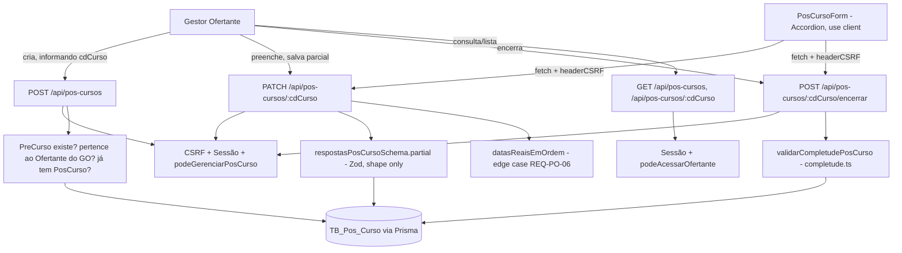

# formulario-pos-curso Design

**Spec**: `.specs/features/formulario-pos-curso/spec.md`
**Status**: Approved

---

## Approach Exploration (rota da API)

`PosCurso.cdCurso` é ao mesmo tempo PK e FK 1:1 para `PreCurso.cdCurso` (sem identidade própria) — isso abre duas formas razoáveis de desenhar a API:

| Approach | Trade-off |
|---|---|
| **A - Coleção de topo `/api/pos-cursos` (Recomendada)** | Espelha exatamente `/api/pre-cursos`/`/api/verbas` já existentes (mesmo formato de Route Handler, mesma ordem RH→CSRF→Sessão→Guard). `cdCurso` já é um identificador estável e público (usado nas URLs do Pré-Curso) - reaproveitá-lo como chave do recurso Pós-Curso é natural, sem introduzir aninhamento. |
| B - Rota aninhada `/api/pre-cursos/[id]/pos-curso` | Comunica a posse 1:1 mais explicitamente, mas obriga a rota a existir "dentro" de um recurso já fechado (T5-T7, Verified) e não ganha nada que a Approach A não tenha - o `cdCurso` já amarra os dois recursos sem precisar de aninhamento na URL. |

**Decisão:** Approach A. Mesmo raciocínio para as telas: `/pos-cursos/**` como seção própria, não anexada às telas já shipped de `/pre-cursos/**` (evita tocar componentes já Verified).

---

## Architecture Overview

Mesma arquitetura monolítica Next.js App Router já estabelecida (AD-002) e o mesmo padrão fechado por `formulario-pre-curso`: Route Handlers em `src/app/api/pos-cursos/**`, Server Components para leitura/guarda de sessão, um Client Component único para o formulário interativo. `PosCurso.respostas` é `Json?` no Prisma (já existe no schema) - a FORMA é a autoridade do Zod (AD-004/AD-034), não o banco.

Diferença estrutural chave: `PosCurso` não tem `CD_Ofertante` próprio - todo guard de autorização precisa do `cdOfertante` do `PreCurso` pai (via `include: { preCurso: true }` ou consulta equivalente).



---

## Code Reuse Analysis

### Existing Components to Leverage

| Component | Location | How to Use |
|---|---|---|
| `podeGerenciarPreCurso` | `src/lib/auth/guards.ts` | Reexportado como `podeGerenciarPosCurso` (alias) - a regra de autorização de escrita é idêntica (só o GO vinculado ao Ofertante-alvo, `cdOfertante` vindo do `PreCurso` pai neste caso). Nenhuma lógica nova, ver Tech Decisions. |
| `podeAcessarOfertante` | `src/lib/auth/guards.ts` | Reuso direto para os guards de LEITURA (REQ-PO-11/12/13), com o `cdOfertante` do `PreCurso` pai. |
| `comTratamentoDeErro` | `src/lib/errors/api-error.ts` | Envolve todo Route Handler novo, igual às rotas de Pré-Curso/Verba/Ofertante. |
| `verificarCSRF` | `src/lib/security/csrf.ts` | Toda mutação (`POST`/`PATCH`) checa CSRF antes da sessão, mesma ordem já usada em `pre-cursos/route.ts`. |
| `headerCSRF` | `src/lib/security/csrf-client.ts` | Client component anexa o header em cada `fetch`. |
| `obterSessao` | `src/lib/auth/session.ts` | Autenticação em toda rota de API. |
| `Accordion`/`RadioGroup`/`Checkbox`/`Select`/`Textarea`, `Field*`, `Input`, `Button`, `Card` | `src/components/ui/*` | Já existem (adicionados em `formulario-pre-curso`, T4) - nenhum novo componente shadcn necessário; os 26 campos usam exatamente os mesmos 5 tipos de controle do Pré-Curso. |
| Padrão de renderização orientado a metadados (`BLOCOS`/`renderCampo`) | `src/app/(protegido)/pre-cursos/[id]/PreCursoForm.tsx` | Mesmo padrão aplicado a `PosCursoForm.tsx`: uma tabela de blocos/campos interpretada genericamente, em vez de 26 blocos JSX escritos à mão. |
| Padrão de schema duplo + completude como função pura | `src/lib/validation/schemas/pre-curso.schema.ts`, `src/lib/pre-curso/completude.ts` | Mesmo padrão (schema de FORMA + `.partial()` para PATCH, função de COMPLETUDE separada) - com uma diferença deliberada: a completude aqui já nasce como checagem independente de `safeParse`, sem depender de `.superRefine` encadeado (ver Tech Decisions - lição de `formulario-pre-curso`). |

### Integration Points

| System | Integration Method |
|---|---|
| `TB_Pos_Curso` (model `PosCurso`) | Já existe no schema (`cdCurso` PK+FK, `status`, `respostas Json?`, `criadoPor`, `dataEncerramento`). Nenhuma migration nesta feature. |
| `TB_Pre_Curso` (model `PreCurso`) | Consultada em toda rota para obter `cdOfertante` (autorização) e para a tela `/pos-cursos/novo` listar os elegíveis (`posCurso: null`, usando o back-relation já existente no schema). Nenhuma alteração no model. |

---

## Components

### `src/lib/validation/schemas/pos-curso.schema.ts`

- **Purpose**: Fonte única de verdade da FORMA dos 26 campos (AD-004) - usada pelo servidor (PATCH) e reexportada para a UI montar as opções de cada `Select`/`RadioGroup`/checkbox group.
- **Location**: `src/lib/validation/schemas/pos-curso.schema.ts`
- **Interfaces**:
  - `criarPosCursoSchema: ZodObject` - `{ cdCurso: number }` (REQ-PO-01).
  - `respostasPosCursoSchema: ZodObject` - os 26 campos do Dicionário de Campos (spec.md).
  - `respostasPosCursoParcialSchema` - `.partial()` da acima, para PATCH.
  - `datasReaisEmOrdem(dados: { posExecDataInicioReal?: string; posExecDataTerminoReal?: string }): boolean` - edge case REQ-PO-06, mesma técnica de `ordemDatasValida` do Pré-Curso (comparação lexicográfica de `YYYY-MM-DD`, só valida quando as duas datas estão presentes), implementada como função própria e não compartilhada - ver Tech Decisions.
  - Constantes de opções exportadas por campo (`OPCOES_PROBLEMAS_ESTUDO`, `OPCOES_MOTIVOS_ABANDONO`, …).
- **Dependências**: `zod`.
- **Reuses**: mesmo padrão de arquivo de `pre-curso.schema.ts`.

### `src/lib/pos-curso/completude.ts`

- **Purpose**: Decide se um Pós-Curso pode ser encerrado (REQ-PO-09/10) - a única regra condicional (REQ-PO-07) mais a obrigatoriedade plena dos 26 campos.
- **Location**: `src/lib/pos-curso/completude.ts`
- **Interfaces**:
  - `validarCompletudePosCurso(respostas: unknown): { completo: boolean; pendentes: string[] }` - roda `respostasPosCursoSchema.safeParse` para as 25 chaves sempre-obrigatórias e uma função pura separada (`pendenciasCondicionais`) para a 1 chave condicional, unindo os dois conjuntos de pendências - **desde o início** no formato que `formulario-pre-curso` só chegou depois do Verifier apontar que `.superRefine` encadeado é pulado pelo Zod quando o schema base já tem qualquer issue (`.specs/LESSONS.md`).
- **Dependências**: `respostasPosCursoSchema` (acima).
- **Reuses**: a lição/técnica já validada em `src/lib/pre-curso/completude.ts` (estrutura igual, sem reexportar código porque os campos são inteiramente diferentes).

### `src/lib/auth/guards.ts` (extensão mínima)

- **Purpose**: Alias de leitura para deixar explícito, nos call sites das rotas de Pós-Curso, qual regra está sendo aplicada - sem duplicar lógica.
- **Location**: `src/lib/auth/guards.ts` (arquivo existente, 1 linha nova)
- **Interfaces**: `export const podeGerenciarPosCurso = podeGerenciarPreCurso;`
- **Dependências**: nenhuma nova.
- **Reuses**: `podeGerenciarPreCurso` (já existente) - mesma regra (`usuario.tipo === "GO" && usuario.cdOfertante === cdOfertanteAlvo`), aplicada aqui ao `cdOfertante` do `PreCurso` pai em vez do próprio.

### `src/app/api/pos-cursos/route.ts`

- **Purpose**: `POST` cria (REQ-PO-01/02/03), `GET` lista escopado (REQ-PO-12).
- **Location**: `src/app/api/pos-cursos/route.ts`
- **Interfaces**: `POST`, `GET`.
- **Dependências**: `criarPosCursoSchema`, `podeGerenciarPosCurso`. `POST` busca o `PreCurso` pelo `cdCurso` informado (404 se não existir), confere `podeGerenciarPosCurso(sessao.usuario, preCurso.cdOfertante)` (403 fora de escopo), confere se já existe `PosCurso` para esse `cdCurso` (409 se sim - `findUnique` antes do `create`, para devolver um 409 limpo em vez de deixar a constraint de PK do Prisma estourar como 500). `GET` usa o mesmo switch de escopo de `listarPreCursos`, mas filtrando por `preCurso: { cdOfertante }` (relação, não coluna própria).
- **Reuses**: estrutura 1:1 de `src/app/api/pre-cursos/route.ts`.

### `src/app/api/pos-cursos/[cdCurso]/route.ts`

- **Purpose**: `GET` consulta escopada (REQ-PO-11), `PATCH` grava respostas parciais (REQ-PO-04/05/06, bloqueio se `ENCERRADO` por REQ-PO-08).
- **Location**: `src/app/api/pos-cursos/[cdCurso]/route.ts`
- **Interfaces**: `GET`, `PATCH`.
- **Dependências**: `respostasPosCursoParcialSchema`, `datasReaisEmOrdem`, `podeAcessarOfertante` (GET), `podeGerenciarPosCurso` (PATCH). Toda consulta usa `prisma.posCurso.findUnique({ where: { cdCurso }, include: { preCurso: true } })` para ter `cdOfertante` disponível.
- **Reuses**: estrutura 1:1 de `src/app/api/pre-cursos/[id]/route.ts`, incluindo o merge raso em memória e a checagem de ordem de datas contra o estado MESCLADO (mesma técnica que fechou REQ-PC-06 no Pré-Curso).

### `src/app/api/pos-cursos/[cdCurso]/encerrar/route.ts`

- **Purpose**: `POST` transição irreversível de status (REQ-PO-09/10, AD-018).
- **Location**: `src/app/api/pos-cursos/[cdCurso]/encerrar/route.ts`
- **Interfaces**: `POST`.
- **Dependências**: `validarCompletudePosCurso`, `podeGerenciarPosCurso`.
- **Reuses**: mesma ordem RH→CSRF→Sessão→Guard e mesmo formato de `src/app/api/pre-cursos/[id]/encerrar/route.ts`.

### `src/app/(protegido)/pos-cursos/**` (Server Components + 1 Client Component)

- **Purpose**: `page.tsx` (listagem, Server Component com `requireSession`), `novo/page.tsx` + `NovoPosCursoForm.tsx` (criação - form pequeno, 1 campo: seleção do Pré-Curso elegível), `[cdCurso]/page.tsx` + `PosCursoForm.tsx` (o formulário de 26 campos em Accordion, Client Component).
- **Location**: `src/app/(protegido)/pos-cursos/`
- **Interfaces**: nenhuma pública além das páginas Next.js; `PosCursoForm` recebe `{ cdCurso, status, respostasIniciais, podeEditar }` como props (mesmo contrato de `PreCursoForm`).
- **Dependências**: componentes shadcn já existentes (nenhum novo).
- **Reuses**: padrão exato de `pre-cursos/novo/` e `pre-cursos/[id]/` (Client Component colocado, `useState` + `fetch` + `headerCSRF`, `BLOCOS`/`renderCampo` orientado a metadados, sem lib de formulário externa).

---

## Data Models

### `RespostasPosCurso` (forma do JSON em `PosCurso.respostas`)

```typescript
// Gerado a partir do Dicionário de Campos em spec.md - 26 chaves.
// Todas opcionais no tipo (reflete PATCH parcial); a obrigatoriedade real
// é imposta por validarCompletudePosCurso, não pelo tipo TypeScript.
interface RespostasPosCurso {
  // Bloco 1 - Acompanhamento Pedagógico
  posAcompanhProblemasEstudo?: string[];
  posAcompanhConceitosTrabalhados?: string;
  posAcompanhPlanoAcao?: string;
  posAcompanhAvaliacaoCognitiva?: "Prova escrita" | "Trabalho prático" | "Avaliação oral" | "Portfólio" | "Não foi realizada avaliação cognitiva";
  posAcompanhMonitoramento?: string[];
  // Bloco 2 - Execução
  posExecDataInicioReal?: string; // ISO date
  posExecDataTerminoReal?: string;
  posExecCargaHorariaRealizada?: number;
  posExecDificuldadesEnfrentadas?: string[];
  posExecHouveAlteracaoPlanejamento?: "Sim" | "Não";
  posExecAlteracaoDetalhe?: string;
  // Bloco 3 - Participação
  posParticNumInscritos?: number;
  posParticNumMatriculados?: number;
  posParticNumConcluintes?: number;
  posParticMotivosAbandono?: string;
  posParticRelacaoDemandaOferta?: "Demanda superou a oferta de vagas" | "Demanda foi igual à oferta" | "Demanda foi menor que a oferta";
  posParticIntencaoNovaOferta?: "Sim" | "Não" | "Ainda não definido";
  // Bloco 4 - Financeiro
  posFinValorTotalExecutado?: number;
  posFinValorDespesaDocentes?: number;
  posFinValorDespesaMaterialDidatico?: number;
  posFinValorDespesaInfraestrutura?: number;
  posFinHouveDevolucaoRecursos?: "Sim" | "Não";
  posFinValorDevolvido?: number;
  posFinNecessidadeAditivo?: "Sim" | "Não";
  // Bloco 5 - Continuidade
  posContEstrategiasContinuidade?: string[];
  posContEstrategiasAmpliacao?: string[];
}
```

**Relationships**: 1:1 com `PosCurso.respostas` (coluna `Json?`). `PosCurso.cdCurso` é PK e FK ao mesmo tempo para `PreCurso.cdCurso` - não há coluna `cdOfertante` própria, sempre obtida via o `PreCurso` pai.

---

## Error Handling Strategy

| Error Scenario | Handling | User Impact |
|---|---|---|
| `cdCurso` de criação não existe (REQ-PO-01) | 404 antes de tocar `PosCurso` | "Pré-curso não encontrado" |
| `cdCurso` de criação pertence a outro Ofertante (REQ-PO-03) | 403 antes de checar duplicidade (mesmo padrão de `podeAcessarOfertante` nas rotas de Verba/Pré-Curso) | "Acesso negado" |
| `cdCurso` já tem Pós-Curso (REQ-PO-02) | 409, checado via `findUnique` antes do `create` | "Este curso já tem um Pós-Curso" |
| Campo fora de forma no PATCH (REQ-PO-05) | 400, `entrada.error.issues[0]?.message` (mesmo padrão herdado das outras rotas) | Mensagem do campo inválido |
| `posExecDataTerminoReal` anterior a `posExecDataInicioReal` (REQ-PO-06) | 400, checado contra o estado MESCLADO | "Data de término não pode ser anterior à data de início" |
| Valor monetário negativo | 400 (Zod `.min(0)` em cada campo de valor) | Mensagem do campo inválido |
| Encerramento com pendências (REQ-PO-09) | 400 com `{ pendentes: string[] }` completo | UI destaca todos os blocos/campos faltantes de uma vez |
| Gravação ou encerramento em Pós-Curso já `ENCERRADO` (REQ-PO-08) | 409 Conflict, dado não tocado | "Este Pós-Curso já foi encerrado e não pode mais ser alterado" |
| Erro não previsto | `comTratamentoDeErro` - 500 genérico + id de correlação (herdado) | Mensagem genérica + código de suporte |

---

## Risks & Concerns

| Concern | Location (file:line) | Impact | Mitigation |
|---|---|---|---|
| `PosCurso` não tem `cdOfertante` próprio - todo guard depende de um `include`/consulta extra ao `PreCurso` pai | `src/app/api/pos-cursos/**` (a criar) | Esquecer o `include: { preCurso: true }` numa rota nova quebraria a autorização silenciosamente (ex.: `cdOfertante: undefined` faria `podeAcessarOfertante`/`podeGerenciarPosCurso` sempre `false` - falha fechada, não uma falha de segurança, mas quebraria a feature) | Cada rota testada em e2e confirma 200 no próprio Ofertante E 403 fora dele - qualquer esquecimento do `include` derruba o teste do caminho feliz, não passa silenciosamente |
| `podeGerenciarPosCurso` é só um alias de `podeGerenciarPreCurso` | `src/lib/auth/guards.ts` (extensão) | Se a regra de autorização de escrita do Pós-Curso um dia divergir da do Pré-Curso (ex.: spec futura permitir AM/GT escreverem Pós-Curso), o alias quebraria silenciosamente ao ser esquecido | Documentado aqui e no Tech Decisions - próxima feature que precisar divergir separa a função, não reaproveita o alias |
| `validarAlocacao`/saldo de Verba não se aplica ao Pós-Curso (nenhum campo financeiro do Bloco 4 é validado contra a Verba) | `src/lib/pos-curso/completude.ts` (a criar) | Os valores de despesa (Bloco 4) são só relato pós-execução, não uma nova alocação - não há RN no documento fonte pedindo comparação com a Verba original | Não é um risco de fato: fora do escopo desta feature por design (spec.md Out of Scope não lista isso porque o documento fonte nunca pede essa comparação) |

> Nenhum outro ponto de fragilidade/dívida técnica identificado nas áreas tocadas (rotas de Pré-Curso, guards, csrf, error handler, componentes shadcn) - todos já cobertos e estáveis por `formulario-pre-curso`.

---

## Tech Decisions (only non-obvious ones)

| Decision | Choice | Rationale |
|---|---|---|
| Rota da API: coleção de topo vs aninhada em `/pre-cursos` | `/api/pos-cursos` (topo) | Ver Approach Exploration acima - espelha o padrão já estabelecido, evita tocar rotas já Verified. |
| Autorização de escrita: nova função vs alias | `podeGerenciarPosCurso = podeGerenciarPreCurso` (alias) | Regra idêntica (GO dono do Ofertante-alvo) - duplicar a função só para ter um nome diferente violaria "no abstractions for single-use code" pelo lado oposto (duplicação sem motivo). |
| `validarCompletudePosCurso`: `.superRefine` encadeado vs checagem independente desde o início | Checagem independente (mesma técnica que `formulario-pre-curso` só adotou depois do Verifier) | Lição já registrada em `.specs/LESSONS.md` a partir do achado do Verifier na feature anterior - aplicar desde o Design evita repetir o mesmo ciclo fix→re-verify. |
| `datasReaisEmOrdem` (Pós-Curso) vs reaproveitar `ordemDatasValida` (Pré-Curso) via extração para um módulo compartilhado | Função própria, não compartilhada | A duplicação é de ~4 linhas; extrair um módulo `src/lib/validation/datas.ts` só para isso obrigaria tocar `pre-curso.schema.ts` (já Verified) sem ganho real - três linhas repetidas são preferíveis a uma abstração prematura de uso único até hoje. |
| Elegibilidade da tela `/pos-cursos/novo` | `prisma.preCurso.findMany({ where: { cdOfertante, posCurso: null } })` | Usa o back-relation `posCurso PosCurso?` já existente no schema (`PreCurso`, linha 176) - nenhuma migration, nenhuma query manual de exclusão. |

---

## Tips

- Nenhuma migration Prisma necessária - `TB_Pos_Curso` já existe no schema desde o Design de `formulario-pre-curso` (nota "AD-017, AD-018, AD-019" no schema).
- Nenhum componente shadcn novo - os 5 tipos de controle (`RadioGroup`, `Checkbox`, `Select`, `Textarea`, `Accordion`) já foram adicionados em `formulario-pre-curso` T4.
