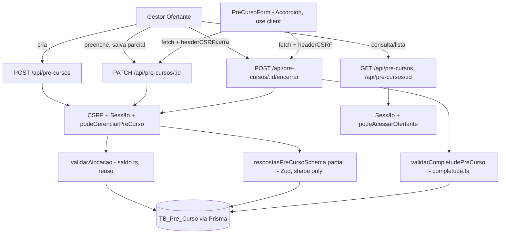

# formulario-pre-curso Design

**Spec**: `.specs/features/formulario-pre-curso/spec.md`
**Status**: Approved
**Abordagem de UI confirmada com o usuário:** página única com os 12 blocos como seções `Accordion` recolhíveis (ver pergunta respondida nesta sessão) — descartadas as alternativas de wizard sequencial (impõe ordem que a spec não exige) e abas (12 abas não cabem bem na tela).

---

## Architecture Overview

Mesma arquitetura monolítica Next.js App Router já estabelecida (AD-002): Route Handlers em `src/app/api/pre-cursos/**`, Server Components para leitura/guarda de sessão, um Client Component único para o formulário interativo. `PreCurso.respostas` é um `Json?` no Prisma (já existe no schema) — a FORMA é a autoridade do Zod (AD-004), não o banco.



---

## Code Reuse Analysis

### Existing Components to Leverage

| Component | Location | How to Use |
|---|---|---|
| `validarAlocacao` | `src/lib/verba/saldo.ts` | Chamado por `POST /api/pre-cursos` antes de gravar `vlCursoAlocado` (STATE.md já flagou isso como obrigatório). Nenhuma alteração no arquivo. |
| `podeAcessarOfertante` | `src/lib/auth/guards.ts` | Reuso direto para os 3 guards de LEITURA (REQ-PC-13/14/15), com `cdOfertante` do `PreCurso` (via `preCurso.cdOfertante`, sem precisar de join). |
| `comTratamentoDeErro` | `src/lib/errors/api-error.ts` | Envolve todo Route Handler novo, igual às rotas de Ofertante/Verba. |
| `verificarCSRF` | `src/lib/security/csrf.ts` | Toda mutação (`POST`/`PATCH`) checa CSRF antes da sessão, mesma ordem RH→CSRF→Guard já usada em `verbas/route.ts`. |
| `headerCSRF` | `src/lib/security/csrf-client.ts` | Client component anexa o header em cada `fetch`. |
| `obterSessao` | `src/lib/auth/session.ts` | Autenticação em toda rota de API. |
| `Field`/`FieldLabel`/`FieldError`/`FieldGroup`, `Input`, `Button`, `Card`, `Label` | `src/components/ui/*` | Reuso direto para os campos de texto/número/data e para o esqueleto visual dos blocos. |
| Padrão de schema duplo (`verbaSchema` / `edicaoVerbaSchema`) | `src/lib/validation/schemas/verba.schema.ts` | Mesmo padrão aplicado aqui: um schema de FORMA (uso amplo, PATCH parcial) e uma função de COMPLETUDE separada (uso só no encerramento) — ver Componentes. |
| Padrão `.refine`/`.superRefine` condicional | `src/lib/validation/schemas/primeiro-acesso.schema.ts` | Mesma técnica Zod, escalada para 3 grupos de regra condicional (REQ-PC-07/08/09) em vez de 1. |

### Integration Points

| System | Integration Method |
|---|---|
| `TB_Pre_Curso` (model `PreCurso`) | Já existe no schema (`cdCurso`, `cdOfertante`, `cdVerba`, `vlCursoAlocado`, `status`, `respostas Json?`, `criadoPor`, `dataEncerramento`). Nenhuma migration nesta feature. |
| `TB_Verba` (model `Verba`) | Consultada via `validarAlocacao`/`calcularSaldoVerba`, sem alteração. |
| shadcn/ui (AD-006) | Adicionar `radio-group`, `checkbox`, `select`, `textarea`, `accordion` via `npx shadcn add` — os 5 tipos de controle que os 56 campos exigem e que ainda não existem em `src/components/ui/`. |

---

## Components

### `src/lib/validation/schemas/pre-curso.schema.ts`

- **Purpose**: Fonte única de verdade da FORMA dos 56 campos (AD-004) — usada pelo servidor (PATCH) e reexportada para a UI montar as opções de cada `Select`/`RadioGroup`/checkbox group.
- **Location**: `src/lib/validation/schemas/pre-curso.schema.ts`
- **Interfaces**:
  - `criarPreCursoSchema: ZodObject` — `{ cdVerba: number, vlCursoAlocado: number }` (REQ-PC-01).
  - `respostasPreCursoSchema: ZodObject` — os 56 campos do Dicionário de Campos (spec.md), cada um com o tipo/enum correto; construído para ser usado tanto cheio (completude) quanto via `.partial()` (PATCH). Blocos 6/7 usam um helper `escalaInfraestrutura = z.number().int().min(0).max(5)` compartilhado (RN-05/AD-019).
  - Constantes de opções exportadas por campo (ex.: `OPCOES_MODALIDADE`, `OPCOES_INSTITUICAO_EXECUTORA`, `OPCOES_VINCULO_PROGRAMA`, …) — a UI itera essas constantes para renderizar `Select`/`RadioGroup`/checkboxes, nunca hardcoda a lista em dois lugares.
- **Dependências**: `zod`.
- **Reuses**: mesmo padrão de arquivo de `verba.schema.ts`/`primeiro-acesso.schema.ts`.

### `src/lib/pre-curso/completude.ts`

- **Purpose**: Decide se um pré-curso pode ser encerrado (REQ-PC-10) — a ÚNICA função que aplica as 3 regras condicionais (REQ-PC-07/08/09) e a obrigatoriedade plena dos 56 campos, retornando a lista de pendências (não só o 1º erro, diferente do padrão `issues[0]` usado nas outras rotas, porque a spec exige listar todas).
- **Location**: `src/lib/pre-curso/completude.ts`
- **Interfaces**:
  - `validarCompletudePreCurso(respostas: unknown): { completo: boolean; pendentes: string[] }` — roda um schema "cheio" (`respostasPreCursoSchema` sem `.partial()`, chaves obrigatórias) + um `.superRefine` com as 3 regras condicionais; `pendentes` = `error.issues.map(i => i.path.join("."))` deduplicado.
- **Dependências**: `respostasPreCursoSchema` (acima).
- **Reuses**: técnica `.superRefine` de `primeiro-acesso.schema.ts`, escalada.

### `src/lib/auth/guards.ts` (extensão)

- **Purpose**: Adicionar a guarda de ESCRITA para pré-curso — só o GO vinculado ao Ofertante do curso grava respostas ou encerra (REQ-PC-15, item 4 da story de escopo: VO nunca escreve).
- **Location**: `src/lib/auth/guards.ts` (arquivo existente, uma função nova)
- **Interfaces**:
  - `podeGerenciarPreCurso(usuario: { tipo: TipoUsuario; cdOfertante: number | null }, cdOfertanteAlvo: number): boolean` — `true` somente se `usuario.tipo === "GO" && usuario.cdOfertante === cdOfertanteAlvo`. AM/GT/VT/VO/AL sempre `false` (criação e escrita são exclusivas do GO dono, por RN da seção 4 do documento fonte — nenhum outro perfil aparece como escritor deste formulário, diferente de Ofertante/Verba onde AM/GT também escrevem).
- **Dependências**: nenhuma nova (mesmo padrão de `podeEditarOfertante`).
- **Reuses**: estilo/assinatura de `podeAcessarOfertante`/`podeEditarOfertante` já existentes no mesmo arquivo.

### `src/app/api/pre-cursos/route.ts`

- **Purpose**: `POST` cria (REQ-PC-01/02/03), `GET` lista escopado (REQ-PC-14).
- **Location**: `src/app/api/pre-cursos/route.ts`
- **Interfaces**: `POST`, `GET` (Route Handlers, mesmo formato de `verbas/route.ts`).
- **Dependências**: `criarPreCursoSchema`, `validarAlocacao`, `podeGerenciarPreCurso` (POST); `podeAcessarOfertante`-mesmo switch de escopo usado em `listarVerbas` (GET).
- **Reuses**: estrutura 1:1 de `src/app/api/verbas/route.ts`.

### `src/app/api/pre-cursos/[id]/route.ts`

- **Purpose**: `GET` consulta escopada (REQ-PC-13), `PATCH` grava respostas parciais (REQ-PC-04/05/06, bloqueio se `ENCERRADO` por REQ-PC-12).
- **Location**: `src/app/api/pre-cursos/[id]/route.ts`
- **Interfaces**: `GET`, `PATCH`.
- **Dependências**: `respostasPreCursoSchema.partial()`, `podeAcessarOfertante` (GET), `podeGerenciarPreCurso` (PATCH).
- **Reuses**: estrutura 1:1 de `src/app/api/verbas/[id]/route.ts`. O merge raso do JSON acontece em memória (`{ ...atual.respostas, ...corpoValidado }`) antes do `prisma.preCurso.update`.

### `src/app/api/pre-cursos/[id]/encerrar/route.ts`

- **Purpose**: `POST` transição irreversível de status (REQ-PC-10/11/12), rota de ação dedicada — mesmo padrão de `src/app/api/auth/primeiro-acesso` (ação sobre um recurso, não um CRUD verb).
- **Location**: `src/app/api/pre-cursos/[id]/encerrar/route.ts`
- **Interfaces**: `POST`.
- **Dependências**: `validarCompletudePreCurso`, `podeGerenciarPreCurso`.
- **Reuses**: mesma ordem RH→CSRF→Sessão→Guard.

### `src/app/(protegido)/pre-cursos/**` (Server Components + 1 Client Component)

- **Purpose**: `page.tsx` (listagem, Server Component com `requireSession`), `novo/page.tsx` + `NovoPreCursoForm.tsx` (criação — form pequeno, 2 campos), `[id]/page.tsx` + `PreCursoForm.tsx` (o formulário de 56 campos em Accordion, Client Component).
- **Location**: `src/app/(protegido)/pre-cursos/`
- **Interfaces**: nenhuma pública além das páginas Next.js; `PreCursoForm` recebe `{ preCurso, opcoes }` como props (dados carregados no Server Component pai).
- **Dependências**: `Accordion`/`RadioGroup`/`Checkbox`/`Select`/`Textarea` (shadcn, a adicionar), componentes já existentes (`Field*`, `Input`, `Button`, `Card`).
- **Reuses**: padrão exato de `NovoUsuarioForm.tsx` (Client Component separado do `page.tsx` Server Component, `useState` + `fetch` + `headerCSRF`, sem lib de formulário externa) — escalado de campos individuais para um único `useState<Record<string, unknown>>` que guarda todo `respostas`, com um `setCampo(chave, valor)` genérico usado por todos os 56 inputs. Isso evita 56 `useState` (o padrão do projeto não usa `react-hook-form`; introduzir a lib só para esta tela quebraria a consistência sem necessidade — o objeto único resolve o mesmo problema).

---

## Data Models

### `RespostasPreCurso` (forma do JSON em `PreCurso.respostas`)

```typescript
// Gerado a partir do Dicionário de Campos em spec.md - 56 chaves.
// Todas opcionais no tipo (reflete PATCH parcial); a obrigatoriedade real
// é imposta por validarCompletudePreCurso, não pelo tipo TypeScript.
interface RespostasPreCurso {
  // Bloco 1 - Identificação
  identifUf?: string;
  identifMunicipio?: string;
  identifEntidadeResponsavel?: string;
  identifCoordenador?: string;
  identifEmail?: string;
  identifTelefone?: string;
  // Bloco 2 - Dados da Qualificação
  qualifEndereco?: string;
  qualifNomeCurso?: string;
  qualifVinculoPrograma?: "Plano Nacional de Turismo" | "Programa Estadual de Qualificação" | "Programa Municipal de Qualificação" | "Outro";
  qualifVinculoProgramaOutro?: string;
  qualifCaracteristicas?: string[]; // subconjunto de OPCOES_CARACTERISTICAS
  qualifCaracteristicasOutra?: string;
  qualifModalidade?: "Presencial" | "EAD" | "Híbrida";
  qualifRegiao?: "Norte" | "Nordeste" | "Centro-Oeste" | "Sudeste" | "Sul";
  // Bloco 3 - Planejamento
  planejDataInicioPrevista?: string; // ISO date
  planejDataTerminoPrevista?: string;
  planejCargaHoraria?: number;
  planejNumTurmas?: number;
  planejNumAlunosPrevistos?: number;
  planejTaxaEvasaoEsperada?: number;
  planejObjetivo?: string;
  // Bloco 4 - Público-Alvo
  publicoPerfil?: string[];
  publicoInstituicaoExecutora?: "Entidade responsável" | "Empresa contratada" | "Parceria entre Entidade Responsável e Entidade Executora";
  publicoInstituicaoExecutoraNome?: string;
  // Bloco 5 - Diagnóstico
  diagnosticoConsultas?: string[];
  // Blocos 6/7 - Infraestrutura (0-5, ver escalaInfraestrutura)
  infraBasicaBanheiros?: number;
  infraBasicaEnergia?: number;
  infraBasicaSalaAula?: number;
  infraBasicaBiblioteca?: number;
  infraBasicaAcessibilidade?: number;
  infraBasicaLaboratorio?: number;
  infraBasicaAguaPotavel?: number;
  infraBasicaIluminacao?: number;
  infraBasicaConectividade?: number;
  infraComplSalaProfessores?: number;
  infraComplCopa?: number;
  infraComplAuditorio?: number;
  infraComplAudiovisual?: number;
  infraComplTecnologicos?: number;
  infraComplConvivencia?: number;
  infraComplEstacionamento?: number;
  infraComplAlimentacao?: number;
  // Bloco 8 - Infraestrutura Específica
  infraEspecificaNecessidade?: "Sim" | "Não";
  infraEspecificaDisponibilidade?: "Disponível" | "Parcialmente disponível" | "Indisponível";
  infraEspecificaSuficiencia?: "Suficiente" | "Insuficiente";
  infraEspecificaManutencao?: "Em bom estado" | "Necessita manutenção" | "Não aplicável";
  // Bloco 9 - Corpo Docente
  docenteCriteriosSelecao?: string[];
  docenteFormaContratacao?: "CLT" | "Prestação de serviço (RPA/autônomo)" | "Servidor público cedido" | "Voluntariado" | "Outra";
  docenteFormaContratacaoOutra?: string;
  docenteNivelFormacao?: "Ensino médio" | "Graduação" | "Pós-graduação (lato sensu)" | "Mestrado" | "Doutorado";
  docentePoliticasReparacao?: string[];
  // Bloco 10 - Divulgação
  divulgacaoEstrategias?: string[];
  divulgacaoEstrategiasOutra?: string;
  // Bloco 11 - Parcerias
  parceriasEstabelecidas?: string[];
  // Bloco 12 - Suporte ao Aluno
  suporteEstrategias?: string[];
  suporteEstrategiasOutra?: string;
}
```

**Relationships**: 1:1 com `PreCurso.respostas` (coluna `Json?`). `PreCurso` mantém sua FK para `Verba` (`cdVerba`) e o dono implícito via `cdOfertante`, ambos já colunas físicas — só o questionário vira JSON.

---

## Error Handling Strategy

| Error Scenario | Handling | User Impact |
|---|---|---|
| `cdVerba` de outro Ofertante na criação (REQ-PC-03) | 403 antes de tocar o banco (mesmo padrão de `podeAcessarOfertante` nas rotas de Verba) | "Acesso negado" |
| `vlCursoAlocado` acima do saldo (REQ-PC-02) | 400 com `saldoDisponivel` no corpo (reuso do retorno de `validarAlocacao`) | Mensagem + valor exato do saldo, para a UI sugerir o teto |
| Campo fora de forma no PATCH (REQ-PC-05) | 400, `entrada.error.issues[0]?.message` (mesmo padrão das outras rotas — 1 erro por vez basta aqui, o formulário corrige campo a campo) | Mensagem do campo inválido |
| Encerramento com pendências (REQ-PC-10) | 400 com `{ pendentes: string[] }` completo (não só o 1º) | UI destaca todos os blocos/campos faltantes de uma vez, sem ida-e-volta repetida |
| Gravação ou encerramento em pré-curso já `ENCERRADO` (REQ-PC-12) | 409 Conflict, dado não tocado | "Este pré-curso já foi encerrado e não pode mais ser alterado" |
| Erro não previsto (Prisma fora do ar, etc.) | `comTratamentoDeErro` — 500 genérico + id de correlação, log mascarado (REQ-SEC-11/12, herdado) | Mensagem genérica + código de suporte |

---

## Risks & Concerns

| Concern | Location (file:line) | Impact | Mitigation |
|---|---|---|---|
| Nenhum dos 5 tipos de controle necessários (`RadioGroup`, `Checkbox`, `Select`, `Textarea`, `Accordion`) existe em `src/components/ui/` hoje (só `button`, `card`, `field`, `input`, `label`, `separator`) | `src/components/ui/` | Bloqueia a UI até serem adicionados | Task dedicada no início da fase de UI: `npx shadcn add radio-group checkbox select textarea accordion` (AD-006 já autoriza a lib) — mecânico, baixo risco |
| Zod schema de 56 campos é grande e mecânico, risco de transcrição divergir do Dicionário de Campos da spec | `src/lib/validation/schemas/pre-curso.schema.ts` (a criar) | Campo com enum errado passa validação de forma mas falha silenciosamente nos testes de completude/e2e | Teste unitário dedicado que confere `Object.keys(respostasPreCursoSchema.shape).length === 56` e testes por bloco batendo com as opções literais da spec |
| `validarCompletudePreCurso` concentra as 3 regras condicionais (REQ-PC-07/08/09) num único `.superRefine` — fácil esquecer uma ao adicionar/alterar campo | `src/lib/pre-curso/completude.ts` (a criar) | Encerramento aceito com campo condicional faltando (viola CA-04 do documento fonte) | Um teste unitário por regra condicional (3 testes mínimos) mais um teste de "todos os 56 completos, nenhum condicional disparado → completo=true" |
| Nenhuma rota de criação de curso existe ainda para exercitar `validarAlocacao` de ponta a ponta (só testada via Prisma direto em `saldo.integration.test.ts`) | `src/app/api/pre-cursos/route.ts` (a criar) | — | Não é mais um risco após esta feature: é exatamente o gap que `POST /api/pre-cursos` fecha (apontado em STATE.md) |

> Nenhum outro ponto de fragilidade/dívida técnica identificado nas áreas tocadas por esta feature (rotas de Verba/Ofertante, guards, csrf, error handler) — todos já cobertos e estáveis pelas 3 features anteriores.

---

## Tech Decisions (only non-obvious ones)

| Decision | Choice | Rationale |
|---|---|---|
| Estratégia de armazenamento das respostas (`Json?` vs coluna por pergunta) | JSON validado por Zod (opção B já implementada no schema físico) | Formaliza a pendência registrada em `prisma/schema.prisma`/STATE.md — vira **AD-034** em `.specs/STATE.md`. |
| Validação de forma vs. completude | Dois mecanismos separados: `respostasPreCursoSchema.partial()` (forma, todo PATCH) e `validarCompletudePreCurso()` (completude + condicionais, só no encerramento) | Espelha o padrão já existente `verbaSchema`/`edicaoVerbaSchema` (schemas diferentes para intents diferentes) em vez de um único schema com flag de modo, que ficaria mais difícil de ler. |
| Merge de PATCH parcial | Merge raso no servidor (`{ ...atual, ...corpoValidado }`), cliente sempre envia só o(s) bloco(s) alterado(s) | Evita reenviar os 56 campos a cada auto-save; simples porque `respostas` não tem aninhamento (todas as 56 chaves são de 1º nível). |
| Estado do formulário no client | Um único `useState<Record<string, unknown>>` para todo `respostas`, com `setCampo` genérico, em vez de 56 `useState` ou `react-hook-form` | Consistente com o padrão sem-lib-de-formulário já usado em `NovoUsuarioForm.tsx`; 56 `useState` individuais seria inviável de manter, e introduzir uma lib nova só aqui quebraria a consistência do projeto. |
| Guarda de escrita dedicada (`podeGerenciarPreCurso`) em vez de reusar `podeEditarOfertante` | Nova função, GO-only (sem AM/GT) | O documento fonte atribui o preenchimento exclusivamente ao GO (seção 4); `podeEditarOfertante` inclui AM/GT porque Ofertante É editável por eles — semânticas diferentes, reuso indevido esconderia essa diferença. |

> **Decisão de projeto a registrar em STATE.md:** a linha acima sobre estratégia de armazenamento vira `AD-034` (ver memory.md) antes do início de Tasks — fecha a pendência que `cadastro-ofertante-verba` deixou anotada.
