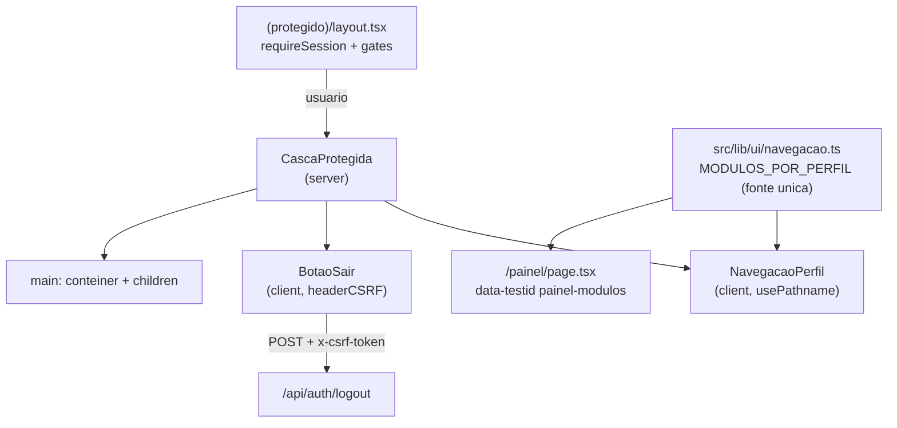

# identidade-visual Design

**Spec**: `.specs/features/identidade-visual/spec.md`
**Status**: Approved

> **Recorte deste Design.** Cobre **apenas a história P1 "Casca comum das telas protegidas"** (UI-01 … UI-07) — o menu de navegação por perfil pedido pelo usuário — mais os dois defeitos de base (UI-20, UI-21) que são **pré-requisito técnico** dele, e a parte de UI-06 que obriga as 11 telas a devolverem o `<main>`. As histórias "Padrões de página" (UI-08…UI-12, UI-22), o resto de "Base visual" (UI-13…UI-16, UI-19) e "Entrada do site" (UI-17, UI-18) **não estão desenhadas aqui** e continuam `Pending` na traceability — quando forem implementadas, este arquivo ganha as seções correspondentes.

---

## Architecture Overview

A navegação nasce de **uma única tabela de módulos por perfil** (função pura, sem I/O), consumida por duas telas: a casca de todas as rotas protegidas e o `/painel`. Nenhuma tela decide sozinha o que um perfil vê.

O layout `(protegido)` já resolve a sessão (`requireSession`) e já roda os dois gates de redirect. Ele passa a envolver `children` numa casca que recebe o `usuario` **por prop** — nenhum componente da casca chama o banco de novo.

Só dois pedaços precisam de JavaScript no cliente: o realce do item ativo (o pathname não é legível em Server Component — `node_modules/next/dist/docs/01-app/03-api-reference/04-functions/use-pathname.md`: *"Reading the current URL from a Server Component is not supported"*) e o botão "Sair" (faz `fetch` com header CSRF). O resto — cabeçalho, marca, identificação, contêiner — permanece Server Component.



---

## Code Reuse Analysis

### Existing Components to Leverage

| Component | Location | How to Use |
| --- | --- | --- |
| `requireSession()` | `src/lib/auth/guards.ts:16` | Já chamado no layout `(protegido)`; a casca recebe o `usuario` daí por prop, sem nova query |
| `MODULOS_POR_PERFIL` | `src/app/(protegido)/painel/page.tsx:10` | **Movido** para `src/lib/ui/navegacao.ts` e enriquecido com rota por item; o painel passa a importá-lo |
| `headerCSRF()` | `src/lib/security/csrf-client.ts` | Único jeito suportado de mutar por `fetch` no cliente (REQ-SEC-15); consumido pelo `BotaoSair` |
| `POST /api/auth/logout` | `src/app/api/auth/logout/route.ts` | Já implementado e testado; hoje nenhum `.tsx` o chama. A casca é o primeiro consumidor |
| `Button` (Base UI) | `src/components/ui/button.tsx` | Botão "Sair"; padrão `render={<Link/>}` já usado nas listagens para link-como-botão |
| `TipoUsuario` | `src/generated/prisma/enums` | Chave do `Record` da navegação — `Record` exaustivo é o padrão da base (`cascata.ts`, `guards.ts`) |
| `cn()` | `src/lib/utils.ts` | Composição de classe condicional do item ativo |

### Integration Points

| System | Integration Method |
| --- | --- |
| `src/app/(protegido)/layout.tsx` | Passa a renderizar `<CascaProtegida usuario={usuario}>{children}</CascaProtegida>` em vez de `<>{children}</>`. A ordem dos guards não muda |
| 11 páginas de `(protegido)` | Cada uma perde só o wrapper `<main className="min-h-screen …">` (vira fragmento), porque a casca passa a prover o `<main>` (UI-06). Card, textos e todo `data-testid` ficam intactos |
| `(onboarding)` e `(public)` | **Não tocados.** `/primeiro-acesso` e `/cadastro-ofertante` são destino dos redirects do layout protegido (ver `SPEC_DEVIATION` em `layout.tsx`) e por definição não têm casca — fecha o último edge case da spec |
| `src/app/globals.css` | Duas correções pontuais (UI-20/UI-21). Nenhuma outra linha do arquivo é tocada nesta passada |

---

## A tabela de navegação (o coração da feature)

O critério não é "o que o perfil vê no painel", é **"que página desse perfil abre e mostra algo"**. Cada linha abaixo foi derivada do escopo já implementado nas próprias telas, não de suposição:

| Item | Rota | AM | GT | VT | GO | VO | AL | Autoridade no código |
| --- | --- | :-: | :-: | :-: | :-: | :-: | :-: | --- |
| Painel | `/painel` | ✅ | ✅ | ✅ | ✅ | ✅ | ✅ | `requireSession` só; landing de todo perfil |
| Novo usuário | `/usuarios/novo` | ✅ | ✅ | — | ✅ | — | — | `TIPOS_PERMITIDOS` (`src/lib/auth/cascata.ts:7`): VT/VO/AL têm lista vazia — a tela abriria com um `select` sem opção |
| Pré-cursos | `/pre-cursos` | ✅ | ✅ | ✅ | ✅ | ✅ | — | `pre-cursos/page.tsx:28` força `cdOfertante: -1` para AL → lista sempre vazia |
| Pós-cursos | `/pos-cursos` | ✅ | ✅ | ✅ | ✅ | ✅ | — | `pos-cursos/page.tsx` idem, via `preCurso.cdOfertante` |
| Avaliações¹ | `/avaliacoes` | ✅ | ✅ | ✅ | ✅ | ✅ | ✅ | `avaliacoes/page.tsx:26` dá ao AL o escopo pelo próprio CPF |

¹ Rótulo do item é **"Minha avaliação"** para AL e **"Avaliações"** para os demais — a mesma rota, nome diferente, porque para o AL ela nunca lista mais que a própria.

**Módulos sem tela** — "Ofertantes", "Verbas", "Relatórios" (só existem como API, ou nem isso) — continuam listados no `/painel` exatamente com o texto de hoje, e **não viram link**. Um link para 404 é pior que a ausência dele (assunção confirmada na spec).

**Isto é conveniência de UI, não autorização.** STATE.md, seção "Autorização": *a cascata (AD-009) e o escopo (AD-012) são reavaliados no backend a cada request — nunca confiar em ocultação de menu*. Digitar `/pre-cursos` como AL continua abrindo a tela com lista vazia, e `POST /api/usuarios` como VT continua barrado. A navegação apenas para de oferecer becos sem saída.

---

## Components

### `navegacao.ts` — fonte única

- **Purpose**: Descrever, para cada `TipoUsuario`, os módulos do painel e os itens navegáveis; resolver qual item está ativo.
- **Location**: `src/lib/ui/navegacao.ts` (módulo puro, sem `"use client"`, sem import de Prisma — importável dos dois lados).
- **Interfaces**:
  ```typescript
  export interface ItemNavegacao {
    rotulo: string;
    href: string;
  }

  /** Um módulo do painel. `itens` vazio = módulo sem tela (não vira link). */
  export interface Modulo {
    rotulo: string;
    itens: ItemNavegacao[];
  }

  export const MODULOS_POR_PERFIL: Record<TipoUsuario, Modulo[]>;

  /** Itens do cabeçalho: "Painel" + os itens de todos os módulos do perfil. */
  export function navegacaoDoPerfil(tipo: TipoUsuario): ItemNavegacao[];

  /** Rótulos para `data-testid="painel-modulos"` — preserva os textos atuais. */
  export function modulosDoPerfil(tipo: TipoUsuario): string[];

  /** href do item ativo, ou null. Casa a rota-pai mais específica. */
  export function hrefAtivo(pathname: string, itens: ItemNavegacao[]): string | null;
  ```
- **Dependencies**: `TipoUsuario` apenas.
- **Reuses**: substitui o literal de `painel/page.tsx:10`, preservando os sete rótulos existentes ("Gestão de usuários", "Ofertantes", "Verbas", "Cursos", "Relatórios", "Meus cursos", "Minha avaliação").

`hrefAtivo` resolve os dois casos que a spec exige: correspondência exata (UI-03) e **sub-rota casando com a rota-pai** (`/avaliacoes/novo` → `/avaliacoes`; `/pre-cursos/12` → `/pre-cursos`). Regra: um item casa quando `pathname === href` ou `pathname.startsWith(href + "/")`; havendo mais de um casamento, vence o `href` mais longo (garante que `/usuarios/novo` não seja ofuscado por um futuro `/usuarios`). Sem nenhum casamento, devolve `null` — nenhum item marcado, como o edge case pede.

### `CascaProtegida` — cabeçalho + contêiner

- **Purpose**: Emoldurar toda tela protegida com marca, navegação, identificação e saída (UI-01, UI-06, UI-07).
- **Location**: `src/components/layout/CascaProtegida.tsx` — **Server Component**.
- **Interfaces**: `CascaProtegida({ usuario, children }: { usuario: { nome: string; tipo: TipoUsuario }; children: ReactNode })`
- **Dependencies**: `navegacaoDoPerfil`, `NavegacaoPerfil`, `BotaoSair`.
- **Estrutura**: `<header>` com a marca textual "SPMA", `<NavegacaoPerfil>`, e à direita `nome` + sigla do perfil (`truncate`, **sem CPF** — REQ-SEC-12) e `<BotaoSair>`; abaixo, `<main className="mx-auto w-full max-w-5xl flex-1 px-4 py-8">{children}</main>`.
- **UI-07**: `header` e `nav` usam `flex flex-wrap`; abaixo de 640px os itens quebram linha. Nenhum drawer, nenhum hambúrguer, nenhum JS para revelar a navegação — a exigência da spec é literalmente essa.

### `NavegacaoPerfil` — os links

- **Purpose**: Renderizar os itens do perfil e marcar o atual com `aria-current="page"` (UI-02, UI-03).
- **Location**: `src/components/layout/NavegacaoPerfil.tsx` — `"use client"`.
- **Interfaces**: `NavegacaoPerfil({ itens }: { itens: ItemNavegacao[] })`
- **Dependencies**: `usePathname` (`next/navigation`), `next/link`, `hrefAtivo`, `cn`.
- **Por que cliente**: `usePathname` é hook de Client Component por design; a doc do Next 16 instalado é explícita que Server Component não lê a URL atual. `cacheComponents` **não** está habilitado em `next.config.ts` e não há `rewrites` (o `src/proxy.ts` só redireciona), então nem o `Suspense` que a doc exige sob `cacheComponents` nem o risco de hydration mismatch por rewrite se aplicam aqui.
- **Marcação**: `<nav aria-label="Navegação principal" data-testid="navegacao-perfil">` com um `<Link>` por item; o ativo recebe `aria-current="page"` (seletor estável para o e2e) além do estilo.

### `BotaoSair` — encerrar a sessão

- **Purpose**: Chamar o logout já existente e levar a `/login` (UI-04, UI-05).
- **Location**: `src/components/layout/BotaoSair.tsx` — `"use client"`.
- **Interfaces**: `BotaoSair()` — sem props.
- **Dependencies**: `headerCSRF()`, `useRouter`, `Button`.
- **Fluxo**: `POST /api/auth/logout` com `headers: { ...headerCSRF() }`. Sucesso (`res.ok`) **ou 401** → `router.replace("/login")` + `router.refresh()`. Qualquer outra resposta ou erro de rede → permanece na página e mostra a mensagem; o botão volta a habilitar. Enquanto pendente o botão fica `disabled` (mata o clique duplo antes de ele existir).

---

## Error Handling Strategy

| Error Scenario | Handling | User Impact |
| --- | --- | --- |
| Logout rejeitado por CSRF (403) | Sem navegação; mensagem "Não foi possível sair. Tente novamente." ao lado do botão | Continua logado, na mesma tela, com aviso — UI-05 |
| Logout sem sessão (401), inclusive 2º clique | Tratado como sucesso: a sessão já não existe | Vai para `/login` — edge case do clique duplo |
| Falha de rede no `fetch` | `try/catch` → mesma mensagem do 403 | Continua na página; nada é perdido |
| `usuario.nome` muito longo | `truncate` + `max-w-` no `<span>` do nome | Reticências; cabeçalho não quebra nem gera scroll horizontal |
| Perfil com um único módulo (AL) | `navegacaoDoPerfil` devolve "Painel" + "Minha avaliação"; espaçamento pelo `gap` do flex | Sem separador solto nem espaço vazio |
| Rota protegida fora da navegação (`/pre-cursos/novo`) | `hrefAtivo` casa a rota-pai `/pre-cursos` | O item pai fica destacado; o usuário sabe onde está |

---

## Risks & Concerns

| Concern | Location (file:line) | Impact | Mitigation |
| --- | --- | --- | --- |
| **Reset fora de camada anula as utilidades de espaçamento.** `* { padding: 0; margin: 0 }` não está em `@layer`, e CSS sem camada vence `@layer utilities` do Tailwind | `src/app/globals.css:24-28` | `gap-*`, `px-*`, `py-*` do cabeçalho e do `<main>` **não aplicam** — o menu sairia com todos os links colados. Sem isso o entregável não é utilizável | Tarefa dedicada (UI-21): mover o reset para `@layer base`, preservando `box-sizing` |
| **`--font-sans: var(--font-sans)` é autorreferência** e invalida a variável | `src/app/globals.css:42-43` | Todo o sistema (menu incluído) renderiza na serifada de fallback | Tarefa dedicada (UI-20): apontar para `var(--font-geist-sans)` / `var(--font-geist-mono)`, que o layout raiz já emite |
| **11 telas trazem o próprio `<main className="min-h-screen">`** | ex.: `src/app/(protegido)/pre-cursos/page.tsx:37` | `<main>` aninhado dentro do `<main>` da casca — HTML inválido e espaçamento dobrado | Remover só o wrapper em cada uma; Card, textos e `data-testid` intocados |
| **A spec diz "introduz AD-035"**, mas AD-035 já existe (questionários fonte, 2026-08-29) | `.specs/STATE.md:133` | Duas decisões com o mesmo número | O número livre é **AD-039**. A AD de camada visual substituível é registrada como AD-039, e a linha do cabeçalho da spec corrigida no mesmo commit |
| **Não existe tela `/usuarios`**, só `/usuarios/novo` | `src/app/(protegido)/usuarios/` | Um item "Gestão de usuários" apontando para `/usuarios` daria 404 | O item aponta para `/usuarios/novo` e se chama "Novo usuário"; o rótulo do módulo no painel continua "Gestão de usuários" |
| **Ocultar o item pode ser lido como autorização** | — | Regressão de segurança se alguém remover um guard "porque o menu já esconde" | Comentário no topo de `navegacao.ts` citando STATE.md ("nunca confiar em ocultação de menu"); nenhum guard é tocado nesta feature |
| **`e2e/painel.spec.ts` compara `painel-modulos` entre GT e AL** | `e2e/painel.spec.ts:31,38` | Extrair a lista para outro arquivo poderia mudar o texto e quebrar o teste | `modulosDoPerfil` devolve exatamente os sete rótulos de hoje; nenhum arquivo de teste é alterado (UI-12) |
| **199 e2e passam a renderizar um cabeçalho novo em toda tela protegida** | `e2e/*.spec.ts` | Um `getByRole("link")` sem escopo em algum spec pode passar a casar com um link do menu | A casca só **adiciona** elementos e usa `data-testid` próprio; a suíte inteira roda antes do commit final. Qualquer colisão é resolvida escopando o seletor **do teste** só se ele já era ambíguo — nunca enfraquecendo a asserção |

---

## Tech Decisions

| Decision | Choice | Rationale |
| --- | --- | --- |
| Onde vive a lista de módulos | `src/lib/ui/navegacao.ts`, função pura | Uma lista só para painel e cabeçalho; duas divergiriam no primeiro módulo novo |
| Forma da navegação | Barra horizontal no cabeçalho, links `flex-wrap` | Máximo de 5 itens por perfil (AM). Sidebar ou drawer custa JS e estado para um problema que não existe nesta escala; UI-07 proíbe depender de JS |
| Fronteira servidor/cliente | Casca no servidor; só `NavegacaoPerfil` e `BotaoSair` no cliente | `usePathname` e `fetch` exigem cliente; manter o resto no servidor evita mandar o objeto `usuario` inteiro para o bundle |
| Sinal de item ativo | `aria-current="page"` | É o requisito literal de UI-03, é acessível, e dá ao e2e um seletor que não depende de classe de estilo |
| Rótulo por perfil (AL) | `MODULOS_POR_PERFIL` carrega o `rotulo` já resolvido por perfil | "Minha avaliação" para AL preserva o vocabulário que o painel já usa hoje |
| 401 do logout | Tratado como sucesso no cliente | A rota responde 401 quando não há sessão (`route.ts:24`) — e "não há sessão" é exatamente o objetivo do botão |
| Escopo das correções de `globals.css` | Só UI-20 e UI-21 nesta passada | São pré-requisito de um menu legível. UI-15 (fixar esquema claro) e UI-13/14 não bloqueiam nada aqui e ficam para a história de Base visual |

> **AD-039 (a registrar no Execute)** — *Camada visual em arquivo único*: toda cor, raio e fonte vive em `src/app/globals.css`; nenhum `.tsx` carrega cor literal. Ocupa o lugar do número AD-035 citado por engano no cabeçalho da spec.

---

## Requirement Coverage (deste Design)

| Requirement | Onde é atendido |
| --- | --- |
| UI-01 | `CascaProtegida` (marca, nav, nome+sigla, "Sair") |
| UI-02 | `navegacaoDoPerfil` / `MODULOS_POR_PERFIL` — fonte única com o painel |
| UI-03 | `NavegacaoPerfil` + `hrefAtivo` → `aria-current="page"` |
| UI-04 | `BotaoSair` (`POST /api/auth/logout` + `headerCSRF`) |
| UI-05 | `BotaoSair` — 403/rede não navegam e exibem mensagem |
| UI-06 | `<main>` único da casca + remoção do `<main>` das 11 telas |
| UI-07 | `flex-wrap` no header e no nav; zero JS para revelar navegação |
| UI-20, UI-21 | Correções em `globals.css` (pré-requisito) |

Não cobertos aqui, por recorte declarado no topo: UI-08…UI-19, UI-22.
