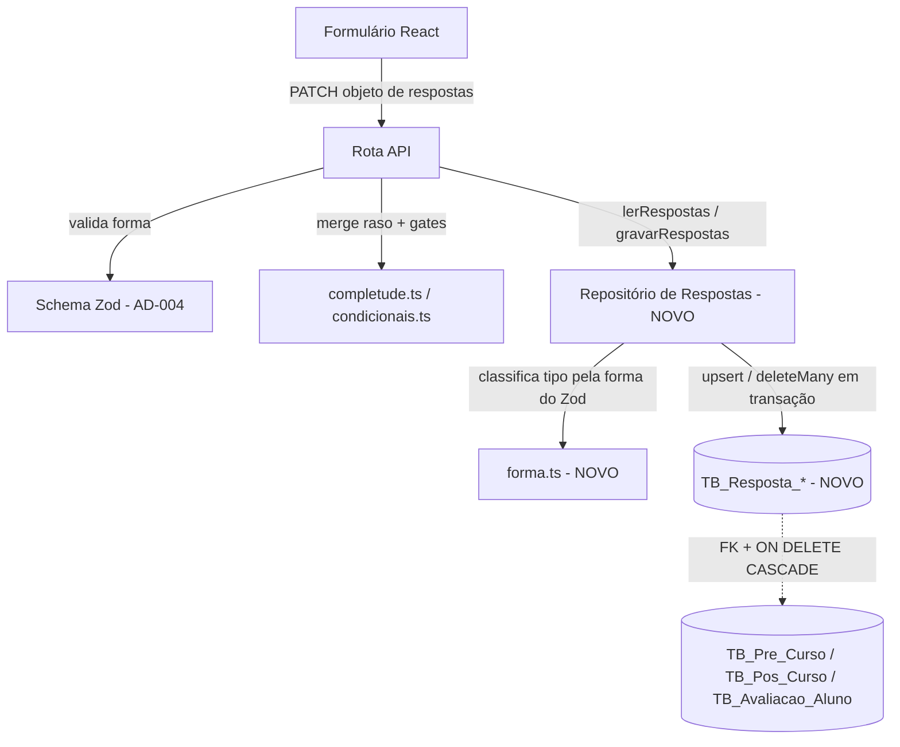

# Respostas Normalizadas Design

**Spec**: `.specs/features/respostas-normalizadas/spec.md`
**Context**: `.specs/features/respostas-normalizadas/context.md`
**Status**: Draft

---

## Architecture Overview

A ideia central é que **só a borda de persistência muda**. Hoje as rotas leem `registro.respostas` (um objeto JS vindo do campo JSON) e gravam o objeto mesclado de volta. Depois desta feature, as rotas leem e gravam pelo mesmo formato de objeto JS - só que ele é **remontado a partir de linhas** na entrada e **explodido em linhas** na saída, por uma camada de repositório nova.

Isso é o que mantém `completude.ts`, `condicionais.ts`, os schemas Zod e os formulários React **sem reescrita**: todos continuam vendo o mesmo objeto `{ chave: valor }` de sempre.



O que **não** muda: rotas de autorização e guardas, schemas Zod, regras de completude, regras condicionais, formulários React, contratos HTTP (mesmo corpo de request e response).

O que muda: três tabelas novas, a coluna `Respostas` some, e as rotas trocam `registro.respostas` / `data: { respostas }` por duas chamadas de repositório.

---

## Code Reuse Analysis

### Existing Components to Leverage

| Component | Location | How to Use |
| --- | --- | --- |
| Schemas Zod dos 3 questionários | `src/lib/validation/schemas/{pre-curso,pos-curso,avaliacao}.schema.ts` | Fonte da classificação de tipo (`ZodArray`/`ZodNumber`/resto). Nenhuma alteração no schema em si. |
| `completude.ts` dos 3 domínios | `src/lib/{pre-curso,pos-curso,avaliacao}/completude.ts` | Reuso literal - continua recebendo o objeto remontado, assinatura inalterada. |
| `condicionais.ts` dos 3 domínios | `src/lib/{pre-curso,pos-curso,avaliacao}/condicionais.ts` | Reuso literal. `normalizarCondicionais*` continua devolvendo o objeto sem as órfãs; o repositório traduz a diferença em `DELETE` de linhas. |
| `comTratamentoDeErro` | `src/lib/errors/api-error.ts` | Sem alteração - envolve as rotas como já envolve. |
| Helpers de fixture e2e | `e2e/helpers/db.ts` | Ponto único onde os testes semeiam `respostas`. Passa a explodir em linhas; os 11 arquivos de spec que chamam o helper continuam passando o mesmo objeto. |
| `prisma.$transaction` | já usado em `src/app/api/usuarios/route.ts` (criação de usuário + verba + matrícula) | Mesmo padrão para tornar o PATCH e o encerramento atômicos. |

### Integration Points

| System | Integration Method |
| --- | --- |
| 6 rotas de formulário (3 `PATCH` + 3 `encerrar`) | Trocam leitura/escrita do campo JSON por `lerRespostas` / `gravarRespostas`. Nenhuma mudança de contrato HTTP. |
| 3 Server Components de página | Hoje passam `registro.respostas` como prop inicial do formulário; passam a passar o objeto remontado pelo repositório. |
| Banco (MySQL 8.4 + Prisma 7) | Três tabelas novas com FK e `ON DELETE CASCADE` para os pais existentes; três migrations em sequência. |

---

## Components

### Classificador de forma

- **Purpose**: dizer, para uma chave de pergunta, se o valor original é lista, número ou texto - para que a remontagem devolva o tipo que o Zod espera.
- **Location**: `src/lib/respostas/forma.ts`
- **Interfaces**:
  - `classificarChave(schema: ZodObject, chave: string): "lista" | "numero" | "texto"`
  - `serializar(valor: unknown): string[]` - um item por linha (lista vira N itens, escalar vira 1)
  - `desserializar(itens: string[], tipo): unknown` - devolve `string[]`, `number` ou `string`
- **Dependencies**: Zod 4.4.3
- **Reuses**: os três schemas existentes, sem alterá-los.

> **Armadilha verificada empiricamente (não deduzida):** em Zod 4.4.3, `ZodArray` **também** expõe `unwrap()`, que devolve o tipo do *elemento*. Desembrulhar em laço (`while (def.unwrap) def = def.unwrap()`) classifica `z.array(z.enum(...)).optional()` como enum simples e corromperia silenciosamente as 13 chaves de múltipla escolha. A implementação deve desembrulhar **apenas** `ZodOptional`/`ZodNullable`/`ZodDefault` e checar `ZodArray` antes de qualquer outro desembrulho. Confirmado rodando contra os três schemas: 13 listas (7 pré-curso, 3 pós-curso, 3 avaliação), 39 numéricas, 75 texto - 127 chaves no total.

### Repositório de respostas

- **Purpose**: traduzir entre o objeto de respostas que o domínio usa e as linhas que o banco guarda.
- **Location**: `src/lib/respostas/repositorio.ts`
- **Interfaces**:
  - `lerRespostas(tx, formulario, id): Promise<Record<string, unknown>>` - remonta o objeto; registro sem linhas devolve `{}`
  - `gravarRespostas(tx, formulario, id, patch): Promise<void>` - merge raso a nível de chave: apaga as linhas das chaves presentes no patch e insere as novas
  - `apagarRespostas(tx, formulario, id, chaves: string[]): Promise<void>` - usado pelo encerramento para descartar as órfãs (AD-038)
- **Dependencies**: Prisma Client, `forma.ts`
- **Reuses**: nada além do client Prisma - é código novo, mas genérico para os três formulários (parametrizado pelo `formulario`, que resolve tabela + coluna de chave-pai + schema Zod).

### Backfill (migração de dados)

- **Purpose**: transformar o JSON já gravado em linhas, antes de a coluna sumir.
- **Location**: `prisma/migrations/<timestamp>_backfill_respostas/migration.sql`
- **Interfaces**: SQL puro, executado por `prisma migrate deploy`
- **Dependencies**: `JSON_TABLE` / `JSON_KEYS` do MySQL 8.4
- **Reuses**: nada. Ver Risks para o porquê de ser SQL e não um script TS.

---

## Data Models

Três tabelas de forma idêntica, uma por formulário (decisão do usuário; ver Tech Decisions).

```prisma
model RespostaPreCurso {
  id       Int      @id @default(autoincrement()) @map("ID_Resposta")
  cdCurso  Int      @map("CD_Curso")
  preCurso PreCurso @relation(fields: [cdCurso], references: [cdCurso], onDelete: Cascade)

  chave    String   @map("Chave") @db.VarChar(100)   // a chave do schema Zod, ex.: "planejCargaHoraria"
  ordem    Int      @default(0) @map("Ordem")        // posição na seleção; 0 para valor escalar
  valor    String   @map("Valor") @db.Text           // o texto que o Zod já valida hoje

  @@unique([cdCurso, chave, ordem])                  // RESP-05: unicidade é constraint física
  @@index([chave])                                   // RESP-18: agregação por pergunta
  @@map("TB_Resposta_Pre_Curso")
}
```

`RespostaPosCurso` é idêntica, apontando para `PosCurso` via `cdCurso`.

`RespostaAvaliacao` difere só na chave-pai, que é composta:

```prisma
model RespostaAvaliacao {
  id        Int   @id @default(autoincrement()) @map("ID_Resposta")
  cpf       String @map("CPF") @db.VarChar(11)
  cdCurso   Int    @map("CD_Curso")
  avaliacao AvaliacaoAluno @relation(fields: [cpf, cdCurso], references: [cpf, cdCurso], onDelete: Cascade)

  chave     String @map("Chave") @db.VarChar(100)
  ordem     Int    @default(0) @map("Ordem")
  valor     String @map("Valor") @db.Text

  @@unique([cpf, cdCurso, chave, ordem])
  @@index([chave])
  @@map("TB_Resposta_Avaliacao")
}
```

**Relationships**: cada tabela é filha 1:N do seu formulário, com `ON DELETE CASCADE` - é isso que fecha RESP-06 sem uma linha de código.

**Leitura do registro inteiro** (o acesso mais frequente: toda página e todo PATCH) é coberta pela coluna líder do índice único, sem índice extra.

---

## Error Handling Strategy

| Error Scenario | Handling | User Impact |
| --- | --- | --- |
| Corpo do PATCH reprovado pelo Zod | Rota devolve 400 antes de abrir transação | Mesma mensagem de hoje; nenhuma linha gravada (RESP-11) |
| Chave de Parte 2 com Parte 1 incompleta | Rota devolve 400 antes de abrir transação | Mesma mensagem de hoje; nem as chaves de Parte 1 do mesmo PATCH entram (RESP-10) |
| Formulário já encerrado | Rota devolve 409 antes de abrir transação | Mesma mensagem de hoje (RESP-09) |
| Falha no meio da gravação de várias chaves | `$transaction` reverte tudo | Nada meio-gravado; o cliente reenvia (RESP-21) |
| Linha com chave que o schema atual não conhece | `lerRespostas` devolve a chave como texto; o Zod da rota é quem decide se ela é aceita numa gravação | Resquício de troca de questionário fica legível, nunca some sozinho (RESP-14) |

---

## Risks & Concerns

| Concern | Location | Impact | Mitigation |
| --- | --- | --- | --- |
| **Footgun de deploy**: `start:prod` roda `prisma migrate deploy && next start` automaticamente. Se a migration que cria as tabelas e a que dropa a coluna subirem juntas sem backfill entre elas, o deploy apaga todas as respostas existentes. | `package.json` (`"start:prod"`) | Perda irreversível de dado em produção | O backfill é uma **migration SQL própria**, não um script TS manual, e entra na sequência entre criar e dropar. `migrate deploy` executa as três em ordem sem passo humano. Task dedicada, com teste que roda a sequência completa sobre uma base semeada. |
| **`ZodArray.unwrap()` devolve o elemento**: desembrulhar em laço corrompe as 13 chaves de múltipla escolha, silenciosamente (viram string em vez de lista). | `src/lib/respostas/forma.ts` (a criar) | Respostas de seleção múltipla truncadas a um valor, sem erro visível | Regra explícita no componente + teste unitário que classifica as 127 chaves reais dos três schemas e afirma as 13 listas nominalmente. Ver a nota verificada em Components. |
| **Lost update em gravação concorrente**: hoje o PATCH faz read-modify-write do JSON inteiro, então dois PATCHes simultâneos no mesmo registro se sobrescrevem. | `src/app/api/avaliacoes/[cpf]/[cdCurso]/route.ts:113-141` e equivalentes | Pré-existente, não introduzido aqui | A normalização **melhora** isso: chaves diferentes deixam de colidir, porque cada uma é uma linha. Mesma chave continua "último a escrever vence", igual a hoje. Sem mudança de requisito; registrado para não parecer regressão. |
| **`valor` é TEXT e não pode ser indexado sem prefixo** no MySQL | `TB_Resposta_*` | Agregação `GROUP BY chave, valor` filtra pelo índice de `chave`, mas não é coberta | Aceito. O índice de `chave` atende RESP-18. Índice com prefixo em `valor` fica para quando os indicadores existirem (AD-024) - adicionar depois é migration aditiva, não quebra nada. |
| **Raio nos testes**: 11 specs e2e e 7 testes unitários montam `respostas`; `e2e/helpers/db.ts` é o ponto de semeadura. | `e2e/helpers/db.ts`, `e2e/*-{id,encerrar}.spec.ts` | Muitos arquivos tocados numa feature de não-regressão | O helper explode o objeto em linhas, então os specs continuam passando o mesmo objeto e **nenhuma asserção existente muda**. Isso é o critério de sucesso da story de não-regressão: se um teste precisar afrouxar asserção, o design está errado. |
| **Perda da imunidade a troca de questionário**: AD-035/036/037 trocaram os três questionários sem nenhuma migration, graças ao JSON. | `.specs/STATE.md:47` | Uma troca futura passa a exigir tocar em dados | Trade-off aceito explicitamente pelo usuário, com a tensão levantada antes da decisão. Registrado na AD nova como custo conhecido, não como descuido. |

---

## Tech Decisions

| Decision | Choice | Rationale |
| --- | --- | --- |
| Uma tabela por formulário vs. tabela única | Três tabelas | Decisão do usuário. FK real e `ON DELETE CASCADE` para cada pai (a avaliação tem chave composta), sem coluna nullable nem discriminador; espelha a estrutura tri-paralela que o código já tem. |
| Identificador da pergunta | A chave do schema Zod, como `VARCHAR(100)` | Já é estável e já é a fonte de verdade da forma (AD-004). Sem registry paralelo. |
| Tipo do valor | Coluna única `TEXT`, tipo reconstruído na leitura a partir da forma do Zod | Evita coluna polimórfica e evita `tipo` redundante que poderia divergir do schema. Verificado que a classificação é derivável nos três schemas. |
| Múltipla escolha | Uma linha por opção, com `ordem` | Torna contagem por opção um `GROUP BY` trivial (uso final escolhido) e preserva o round-trip exato do array. |
| Backfill | Migration SQL, não script TS | `start:prod` roda `migrate deploy` sozinho; um script manual entre migrations seria um passo humano fácil de esquecer, com perda de dado como consequência. |
| Granularidade do merge no `gravarRespostas` | Apaga e reinsere as linhas **das chaves presentes no patch** | Reproduz exatamente o merge raso de hoje, inclusive para listas que encolhem (RESP-04), sem diffing por item. |

> **Decisão de nível de projeto:** esta feature rescinde o **AD-034**. Ao entrar em Execute, `.specs/STATE.md` ganha uma AD nova (próximo número livre: **AD-041**) declarando que as respostas passam a ser normalizadas em `TB_Resposta_*`, com o trade-off registrado, e o AD-034 é marcado como superado por ela. Os três `spec.md` afetados (`formulario-pre-curso`, `formulario-pos-curso`, `avaliacao-aluno`) precisam da mesma retificação, seguindo o precedente do AD-040.
