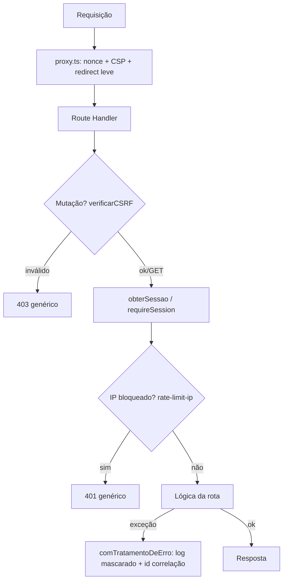

# seguranca-transversal Design

**Spec**: `.specs/features/seguranca-transversal/spec.md`
**Status**: Approved

---

## Architecture Overview

`auth-e-usuarios` já entrega parte desta spec como placeholder (rate-limit por CPF, hash argon2id, cookie httpOnly/secure/sameSite, rotação de sessão, validação Zod server-side). Esta feature fecha o que ficou de fora de propósito: rate-limit por IP, CSP + headers de segurança, CSRF, expiração por inatividade real (sliding window), erro genérico com id de correlação, e mascaramento de CPF em log. Nenhum requisito já satisfeito é reimplementado — cada um é referenciado como reuso.



Duas peças rodam fora do fluxo por requisição:

- `next.config.ts` `headers()`: cabeçalhos estáticos (X-Content-Type-Options, Referrer-Policy, Permissions-Policy, X-Frame-Options, Strict-Transport-Security) em todas as respostas de documento.
- `src/app/error.tsx` / `global-error.tsx`: fronteira de erro do React para exceções de renderização (Server Components), usando o `digest` que o próprio Next já gera como id de correlação.

---

## Code Reuse Analysis

### Existing Components to Leverage

| Component | Location | How to Use |
|---|---|---|
| `estaBloqueado`/`registrarFalha`/`resetarTentativas` (REQ-SEC-01/02) | `src/lib/auth/rate-limit.ts` | Reusado sem alteração; o rate-limit por IP é um módulo irmão, mesmo padrão. |
| `hashPassword`/`verifyPassword` (REQ-SEC-05) | `src/lib/auth/password.ts` | Reusado; ganha uma constante `DUMMY_HASH` exportada para a normalização de tempo (REQ-SEC-04). |
| `primeiroAcessoSchema` min 8 chars (REQ-SEC-06) | `src/lib/validation/schemas/primeiro-acesso.schema.ts` | Já satisfaz CA-SEC-06 - sem mudança. |
| Cookie httpOnly/secure/sameSite + rotação (REQ-SEC-07/08) | `src/lib/auth/session.ts` | Atributos mantidos; só a política de expiração muda (ver Componentes). |
| `obterSessao()` + 401 explícito nas rotas de API (REQ-SEC-14 parcial) | `src/lib/auth/guards.ts`, todas as rotas em `src/app/api/**/route.ts` | Padrão mantido; `comTratamentoDeErro` e `verificarCSRF` se somam a ele, não o substituem. |
| `podeCriar`/`resolverOfertante` (REQ-SEC-14 - cascata) | `src/lib/auth/cascata.ts` | Reusado sem alteração; a guarda de escopo por Ofertante (nova) segue o mesmo estilo (função pura, chamada explícita na rota). |
| Zod server-side autoritativo (REQ-SEC-17) | todos os `*.schema.ts` | Padrão já estabelecido; nenhuma rota nova de validação condicional existe ainda nesta feature (ver Riscos). |
| `e2e/helpers/http.ts` (`cabecalhoCookie`, `idSessaoDaResposta`) | `e2e/helpers/http.ts` | Estendido com equivalentes para o cookie de CSRF; specs existentes que fazem POST autenticado precisam do novo helper (ver Riscos). |

### Integration Points

| System | Integration Method |
|---|---|
| MySQL (Prisma) | Nova tabela `TB_Tentativa_Login_Ip` para o rate-limit por IP (REQ-SEC-03), mesma migração incremental já usada pelo projeto. |
| `proxy.ts` | Ganha geração de nonce + header CSP, mantendo o redirect leve existente e a regra de não importar Prisma (zero dependência, ver `session-cookie.ts`). |
| `next.config.ts` | Ganha `headers()` para os cabeçalhos estáticos que não dependem de nonce. |

---

## Components

### `src/lib/auth/rate-limit-ip.ts` (novo)

- **Purpose**: Rate limiting por IP de origem, independente de CPF (REQ-SEC-03).
- **Location**: `src/lib/auth/rate-limit-ip.ts`
- **Interfaces**:
  - `obterIpCliente(request: Request): string` - lê `x-forwarded-for` (primeiro IP da lista); sem o header, retorna `"desconhecido"` (bucket único, degrada sem quebrar - ver Riscos).
  - `ipEstaBloqueado(ip: string): Promise<boolean>`
  - `registrarFalhaIp(ip: string): Promise<void>` - mesma mecânica de `registrarFalha` (incrementa, bloqueia ao atingir o limite).
- **Dependencies**: `src/lib/db/prisma.ts`, novo model `TentativaLoginIp`.
- **Reuses**: mesmo padrão de `src/lib/auth/rate-limit.ts` (constantes `MAX_TENTATIVAS_IP = 20`, reusa `BLOQUEIO_MS` de `rate-limit.ts`).

### `src/lib/security/csrf.ts` (novo)

- **Purpose**: Double-submit cookie para CSRF (REQ-SEC-15) - sem estado no servidor, sem tabela nova.
- **Location**: `src/lib/security/csrf.ts`
- **Interfaces**:
  - `COOKIE_CSRF = "spma_csrf"`
  - `setCookieCSRF(): Promise<string>` - gera token aleatório (`crypto.randomUUID()`), grava cookie (secure, sameSite=lax, **não** httpOnly - o cliente precisa ler para ecoar no header) e retorna o valor gerado.
  - `verificarCSRF(request: Request): Promise<boolean>` - compara, em tempo constante (`crypto.timingSafeEqual`, com checagem de tamanho antes), o cookie `spma_csrf` da requisição com o header `x-csrf-token`.
  - `limparCookieCSRF(): Promise<void>` - usado no logout.
- **Dependencies**: `next/headers` (`cookies()`), `node:crypto`.
- **Reuses**: nenhum - é a peça que falta; chamado a partir de `setCookieSessao` (login) e `logout/route.ts`.

### `src/lib/security/csrf-client.ts` (novo)

- **Purpose**: Ler o cookie de CSRF no navegador para anexar no header das mutações client-side.
- **Location**: `src/lib/security/csrf-client.ts`
- **Interfaces**:
  - `headerCSRF(): Record<string, string>` - lê `document.cookie`, devolve `{ "x-csrf-token": valor }` ou `{}` se ausente.
- **Dependencies**: nenhuma (roda só no browser).
- **Reuses**: consumido pelos 3 `fetch` client-side que fazem mutação (`login` fica de fora - pré-sessão): `primeiro-acesso/page.tsx`, `cadastro-ofertante/page.tsx`, `usuarios/novo/NovoUsuarioForm.tsx`.

### `src/lib/errors/api-error.ts` (novo)

- **Purpose**: Erro genérico + id de correlação nas rotas de API (REQ-SEC-11), com log mascarado (REQ-SEC-12) no servidor.
- **Location**: `src/lib/errors/api-error.ts`
- **Interfaces**:
  - `comTratamentoDeErro<H extends (...args: any[]) => Promise<Response>>(handler: H): H` - higher-order wrapper; captura qualquer exceção não tratada, loga `console.error(idCorrelacao, erro)` com `mascararCPF` aplicado a qualquer CPF reconhecível na mensagem/contexto, devolve `NextResponse.json({ erro: "Erro interno. Contate o suporte informando o código.", idCorrelacao }, { status: 500 })`.
- **Dependencies**: `src/lib/log/mask.ts`, `node:crypto` (`randomUUID`).
- **Reuses**: envolve todas as rotas em `src/app/api/**/route.ts` (login, primeiro-acesso, logout, usuarios, ofertantes) - substitui o `export async function POST(...)` cru por `export const POST = comTratamentoDeErro(async (...) => {...})`.

### `src/lib/log/mask.ts` (novo)

- **Purpose**: Mascaramento de CPF em log (REQ-SEC-12).
- **Location**: `src/lib/log/mask.ts`
- **Interfaces**:
  - `mascararCPF(cpf: string): string` - mantém 3 primeiros + 2 últimos dígitos, ex.: `529******25`.
- **Dependencies**: nenhuma.
- **Reuses**: usado por `comTratamentoDeErro` e por `rate-limit-ip.ts` se algum log vier a existir ali.

### `src/app/error.tsx` e `src/app/global-error.tsx` (novos)

- **Purpose**: Fronteira de erro do React para exceções de renderização (Server Components) - REQ-SEC-11 no lado de páginas, não de API.
- **Location**: `src/app/error.tsx`, `src/app/global-error.tsx`
- **Interfaces**: componentes padrão Next (`{ error: Error & { digest?: string }, reset: () => void }`), exibem mensagem genérica + `error.digest` (o próprio Next já gera esse id e já loga o detalhe completo no servidor - não precisa de mecanismo próprio aqui).
- **Dependencies**: `"use client"` (exigência do Next para error boundaries).
- **Reuses**: nenhum componente existente; é uma peça puramente nova exigida pela convenção do App Router.

### `src/proxy.ts` (modificado)

- **Purpose**: Soma geração de nonce + header CSP ao redirect leve existente (REQ-SEC-16, parte do CSP).
- **Location**: `src/proxy.ts`
- **Mudança**: matcher passa a cobrir quase todas as rotas de página (exclui `api`, `_next/static`, `_next/image`, `favicon.ico`, prefetch - receita oficial do Next); dentro da função, a checagem de cookie-presença continua restrita às rotas hoje protegidas (`/painel`, `/usuarios`, `/primeiro-acesso`, `/cadastro-ofertante`) via checagem de `pathname`, enquanto o nonce+CSP é aplicado à resposta em qualquer rota casada pelo matcher, incluindo `/login`.
- **Dependencies**: inalteradas (`next/server`, `@/lib/auth/session-cookie` - continua zero-Prisma).
- **Reuses**: a lógica de redirect existente é preservada, só fica condicionada por path em vez de ser a única coisa que o matcher filtra.

### `src/lib/auth/session.ts` (modificado)

- **Purpose**: Expiração por inatividade real (REQ-SEC-09), em vez do TTL fixo desde o login.
- **Mudança**:
  - `buscarSessaoValida(id)`: ao confirmar uma sessão vigente, estende `expiraEm` para `now + SESSAO_TTL_MS` (sliding window) antes de retornar - toda leitura autenticada renova a janela de inatividade.
  - `setCookieSessao(id)`: deixa de fixar `expires` no cookie (vira cookie de sessão do navegador); a autoridade de expiração passa a ser inteiramente o `expiraEm` no banco, MySQL Server Components não conseguem reemitir `Set-Cookie` a cada leitura, então o cookie não pode "deslizar" no cliente - só o servidor precisa saber a verdade (AD-033: nunca confiar no cliente).
- **Reuses**: `SESSAO_TTL_MS` (60 min) continua a mesma constante; `criarSessao`/`rotacionarSessao`/`destruirSessao` inalterados.

### `src/lib/auth/guards.ts` (modificado)

- **Purpose**: Guarda de escopo por Ofertante reutilizável (REQ-SEC-14, parte de "leitura de dados escopados") para features futuras que exponham recursos por Ofertante.
- **Interfaces**:
  - `podeAcessarOfertante(usuario: { tipo: TipoUsuario; cdOfertante: number | null }, cdOfertanteAlvo: number): boolean` - AM/GT sempre `true` (escopo nacional); GO/VO só `true` se `usuario.cdOfertante === cdOfertanteAlvo`; AL sempre `false` (escopo é por curso, não por ofertante - AD-012).
- **Reuses**: mesmo estilo de função pura de `cascata.ts` (`podeCriar`).
- **Nota de escopo**: nenhuma rota desta feature consome essa guarda ainda - não existe hoje nenhum recurso GET escopado por Ofertante (isso chega com `ofertante-e-verba`). Ver Riscos.

---

## Data Models

### `TentativaLoginIp` (nova tabela `TB_Tentativa_Login_Ip`)

```typescript
interface TentativaLoginIp {
  ip: string; // PK - IPv4 ou IPv6, até 45 chars
  tentativas: number; // default 0
  bloqueadoAte: Date | null;
  atualizadoEm: Date; // @updatedAt
}
```

**Relationships**: nenhuma - tabela independente, sem FK (o IP não se relaciona a `Usuario`).

---

## Error Handling Strategy

| Error Scenario | Handling | User Impact |
|---|---|---|
| CPF inexistente / senha errada / conta bloqueada | Resposta idêntica (já existia); agora com tempo normalizado via `DUMMY_HASH` quando não há hash real para comparar | "CPF ou senha inválidos", sem diferença perceptível de tempo |
| IP com tentativas acima do limite | 401 genérico idêntico ao de credencial inválida, contador só decai por tempo (mesmo padrão do CPF) | Mesma mensagem; login real também falha até o cooldown passar |
| Mutação sem token CSRF válido | 403 `{ erro: "Requisição inválida" }` | Formulário mostra erro genérico; usuário recarrega a página (novo cookie CSRF é emitido no próximo GET autenticado) |
| Exceção não tratada em rota de API | `comTratamentoDeErro` gera id de correlação, loga detalhe mascarado no servidor, devolve genérico + id | Usuário vê "Erro interno, código X"; suporte busca X no log |
| Exceção não tratada em Server Component | `error.tsx`/`global-error.tsx`, usa `digest` que o Next já gera e já loga | Mesma UX, aproveitando o mecanismo nativo do framework |

---

## Risks & Concerns

| Concern | Location (file:line) | Impact | Mitigation |
|---|---|---|---|
| CA-SEC-14 não tem hoje nenhum recurso GET escopado por Ofertante para exercitar de ponta a ponta (o cenário do critério - "GO forja requisição a outro Ofertante" - não tem endpoint alvo ainda) | `src/lib/auth/guards.ts` (`podeAcessarOfertante`, novo) | O critério de aceite fica coberto só no nível de unidade nesta feature, não end-to-end | `podeAcessarOfertante` implementado e testado por unidade agora; task explícita documentando que `ofertante-e-verba` (próxima feature de recurso escopado) DEVE chamá-la em toda rota de leitura por Ofertante e adicionar o e2e de CA-SEC-14 naquele ponto |
| CA-SEC-17 cita um exemplo de campo condicional (P9/P9.Qual) que pertence aos formulários de pré/pós-curso, que ainda não existem | nenhum arquivo ainda - feature futura `formularios` | O exemplo literal do critério não é testável nesta feature | Uso do análogo mais próximo já existente: `primeiroAcessoSchema` (`senha === confirmacaoSenha`) provado via POST direto à API bypassando o cliente; nota explícita no rastreamento de que o exemplo P9 precisa de teste próprio quando `formularios` for implementada |
| Rate-limit por IP depende de `x-forwarded-for`, que só é confiável atrás de um proxy reverso que o define corretamente | `src/lib/auth/rate-limit-ip.ts` (novo) | Em deploy sem proxy reverso configurado, todo tráfego pode cair no bucket `"desconhecido"`, tornando o limite por IP inefetivo (mas nunca quebra o login) | Documentado como Assunção (já está em spec.md); mitigação de infra fora do código, fora do escopo desta feature |
| CSP com nonce exige renderização dinâmica; `/login` e o `page.tsx` placeholder da raiz passam a ser dinâmicos | `src/proxy.ts`, `src/app/page.tsx` | Perda de otimização estática nessas duas rotas (custo desprezível - app é majoritariamente autenticado e já dinâmico) | Decisão consciente, documentada em Tech Decisions; sem mitigação necessária |
| Exigir CSRF nas rotas mutantes quebra os specs e2e existentes de `auth-e-usuarios` que só enviam o cookie de sessão | `e2e/primeiro-acesso.spec.ts`, `e2e/usuarios.spec.ts`, `e2e/ofertantes.spec.ts`, `e2e/logout.spec.ts`, `e2e/cadastro-ofertante-page.spec.ts`, `e2e/usuarios-novo-page.spec.ts` | Suite e2e fica vermelha até esses specs serem atualizados | Task dedicada nesta feature: estender `e2e/helpers/http.ts` com helper de CSRF e atualizar os 6 specs antes do gate final |

---

## Tech Decisions (only non-obvious ones)

| Decision | Choice | Rationale |
|---|---|---|
| CSP | Nonce por requisição via `proxy.ts` (receita oficial do Next para App Router), não header estático com `'unsafe-inline'` | Confirmado por inspeção do HTML servido: o Next injeta `<script>` inline (RSC/hydration) - sem nonce, um CSP restrito quebraria a app, e com `'unsafe-inline'` o CSP não bloquearia XSS de verdade (o motivo do REQ-SEC-16 existir). Custo de forçar renderização dinâmica é ~zero aqui (decisão confirmada com o usuário). |
| CSRF | Double-submit cookie sem estado no servidor (cookie legível por JS + header ecoado, comparação em tempo constante), não synchronizer token em banco | Zero tabela nova, zero chamada a banco na validação; suficiente para o modelo de ameaça (origem única, sem subdomínios) e alinhado a AD-002 (reduzir partes móveis) |
| Sessão: expiração por inatividade | Sliding window só no servidor (`expiraEm` estendido a cada leitura válida); cookie vira cookie de sessão do navegador (sem `expires` fixo) | Server Components não conseguem reemitir `Set-Cookie` a cada request (limitação do Next) - só o servidor pode ser a autoridade, então o cookie não precisa (nem consegue) deslizar também |
| Rate-limit por IP: limite | 20 tentativas / 15 min (mesma janela do CPF, limite maior) | Spec deixa o número em aberto ("limite configurado"); 20 evita bloquear NAT/escritório compartilhado com falso-positivo agressivo, ainda mitigando varredura distribuída |
| Normalização de tempo (REQ-SEC-04) | Sempre roda `argon2.verify` (real ou contra `DUMMY_HASH`) antes de decidir o veredito de erro, mesmo quando o CPF não existe | Sem isso, CPF inexistente responde quase instantâneo enquanto senha errada custa o tempo do argon2 - um oráculo de enumeração por tempo que a spec pede para fechar (CA-SEC-04 menciona "tempo aproximado" explicitamente) |

> **Project-level decision**: A normalização de tempo do login (linha acima) e a mudança de `setCookieSessao` para cookie de sessão do navegador tocam comportamento já shipado em `auth-e-usuarios`. Não é uma nova AD de projeto (é a própria formalização de REQ-SEC-04/09 que `auth-e-usuarios` deixou como placeholder, conforme já registrado no Handoff de `STATE.md`) - não requer nova entrada em `## Decisions`.

---

## Deviation from skill's spec template

`validate_spec.py` acusa 5 seções obrigatórias do template do skill ausentes (`Problem Statement`, `Out of Scope`, `Assumptions & Open Questions`, `User Stories`, `Requirement Traceability`). O `spec.md` desta feature (como o de `auth-e-usuarios`) é portado do documento de especificação do cliente (`SPMA_Especificacao_Cliente_v2.md`, ver STATE.md "Fonte da Spec") e usa a estrutura EARS já aprovada pelo cliente (Requisitos/Assunções/Critérios de Aceitação) em vez do template do skill. Mesmo deviation aceito em `auth-e-usuarios` (que passou por todo o ciclo Design→Tasks→Execute→Validate com o mesmo spec.md e fechou com `validation.md` = PASS) - manter a mesma decisão aqui por consistência, sem reescrever um documento já aprovado pelo cliente para caber num template genérico.
