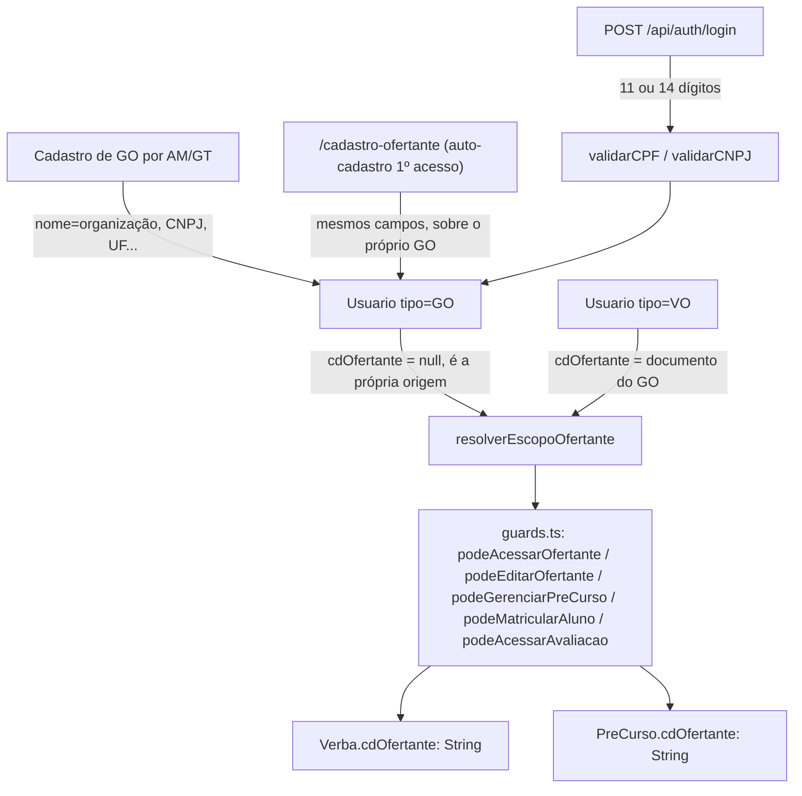

# unificacao-ofertante-go Design

**Spec**: `.specs/features/unificacao-ofertante-go/spec.md`
**Status**: Approved — as 3 decisões (A1, B1, C) foram confirmadas pelo usuário em 2026-09-12 e registradas como AD-043 em `.specs/STATE.md`.

---

## 0. Investigação prévia (Knowledge Verification Chain, passo 1)

Antes de decidir, consultei o banco de dev real (`spma`, `localhost:3306`, `.env`) via Prisma para saber a cardinalidade ATUAL de Ofertante→GO, em vez de supor:

```
Ofertantes: 1 (cdOfertante=2, "Instituto Turismo Litoral (demo)")
GOs: 1 (cpf=60000369900, "Marina Duarte (demo)")
VOs: 1 (cpf=70000000310, "Beatriz Lima (demo)")
Verbas: 1 · PreCursos: 1 · AvaliacaoAluno: 2 · Usuarios totais: 8
Grupos com >1 GO por Ofertante: nenhum
GOs sem Ofertante vinculado: nenhum
```

Toda a base é dado de demonstração produzido por `scripts/dev-seed-demo.ts` (sufixo "(demo)" nos nomes) — **não há produção, não há usuário real**. Isso decide a Decisão #2 abaixo: não existe hoje nenhum caso de "mais de um GO sob o mesmo Ofertante" para migrar, e não há custo real de descartar os dados de demo (o próprio script que os criou os recria).

---

## 1. Arquitetura — abordagens consideradas

### Decisão central A — forma física da PK de `Usuario`

| # | Abordagem | Como funciona |
| - | --- | --- |
| A1 (recomendada) | **PK homogênea `documento`** | Renomeia `Usuario.cpf` → `Usuario.documento` (`@id @db.VarChar(14)`), guardando 11 dígitos (AM/GT/VT/AL) ou 14 (GO). `tipo` já é o discriminante de forma no schema hoje (`cdOfertante` só é não-nulo para GO/VO) — o documento passa a seguir a mesma regra. |
| A2 | **PK heterogênea, chave substituta** | `Usuario` ganha um `id` (uuid/autoincrement) como PK real; `cpf String? @unique` e `cnpj String? @unique` viram colunas mutuamente exclusivas. Toda FK que hoje aponta para `cpf` (`Sessao.cpfUsuario`, `Usuario.criadoPor`/`criador`, `PreCurso.criadoPor`, `PosCurso.criadoPor`) passa a apontar para `id`. Login precisa buscar por `cpf` OU `cnpj` (duas consultas/índices, não mais um único lookup de PK). |

**Recomendação: A1.** Motivos:

1. **Precedente direto no próprio schema.** `TipoUsuario` já é um discriminante que muda o que os outros campos significam (`cdOfertante` nulo para AM/GT/VT/AL, não-nulo para GO/VO; `dadosPessoaisCompletos` só relevante para AL). A1 estende exatamente esse padrão ao documento, em vez de introduzir uma forma nova.
2. **Menor raio de quebra estrutural.** A2 obriga trocar a PK de toda relação que hoje usa `cpf` como chave natural (`criadoPor`/`criador`, `Sessao`, `PreCurso.criadoPor`, `PosCurso.criadoPor`) para um `id` substituto que não existe em NENHUMA outra tabela do schema hoje (todas as PKs no projeto são chaves naturais/de negócio: `cpf`, `cdOfertante`, `cdVerba`, `cdCurso`, composto `cpf+cdCurso`). Introduzir a primeira PK substituta do schema só para este caso quebra a consistência do desenho inteiro por um motivo que A1 resolve sem isso.
3. **Login mais simples.** A1 mantém "1 lookup de PK" no login (`WHERE documento = ?`), independente de o valor ter 11 ou 14 dígitos. A2 exigiria duas consultas por tentativa de login (ou um índice funcional combinando as duas colunas).
4. **Custo aceito, documentado.** A1 perde a garantia de tipo "este campo tem sempre 11 dígitos" — código que hoje assume isso implicitamente (máscara de exibição, `mascararCPF` de AD-029) precisa virar `tipo`-aware. Isso é mecânico (o compilador TS aponta cada `.cpf` depois do rename) e localizado: `mascararCPF`/formatação de exibição, e os poucos lugares que hoje leem `.cpf` fora de guards/cascata (grep confirma: `guards.ts`, `cascata.ts`, `session.ts`, rotas de usuários/login/avaliação, schemas Zod, `e2e-fixture.ts`).

**Nomes que ficam como estão, de propósito (reduz o diff, pedido do usuário desta sessão de manter testes/mudanças enxutos):**
- `AvaliacaoAluno.cpf`, `RespostaAvaliacao.cpf`, `DadoPessoalAluno.cpf`, `Sessao.cpfUsuario` continuam se chamando `cpf` — são sempre referências a um Aluno (AL nunca muda de documento), então o nome continua preciso; só o tipo da coluna que referenciam (`Usuario.documento`) muda de capacidade.
- `Usuario.criadoPor`/`criador`, `PreCurso.criadoPor`, `PosCurso.criadoPor` já têm nome genérico (não dizem "cpf") — só a largura da coluna muda.
- **`cdOfertante` continua se chamando `cdOfertante`** em todo o código (guards, cascata, rotas, fixtures) — só o tipo Prisma muda de `Int` para `String @db.VarChar(14)`, passando a guardar o CNPJ do GO em vez de um código substituto. Renomear esse campo para algo como `cnpjGestorOfertante` seria "mais correto" semanticamente, mas multiplica o diff em ~15 arquivos sem mudar nenhum comportamento — decisão deliberada de manter o nome, documentada aqui para não parecer descuido.

### Decisão central B — onde vivem os dados organizacionais do GO

| # | Abordagem | Como funciona |
| - | --- | --- |
| B1 (recomendada) | **Colunas inline em `Usuario`** | `nome` (já existe) passa a significar "nome da organização" para GO; `responsavel`, `telefone`, `uf`, `municipio` viram colunas novas, nulas, só preenchidas para GO. `model Ofertante` é removido. |
| B2 | **Tabela 1:1 chaveada pelo `documento` do GO** | Mantém uma tabela separada (ex. `DadosOrganizacionais`), agora com PK = FK = `documento` do GO, 1:1. |

**Recomendação: B1.** Motivos:

1. **Custo de leitura em toda guarda de gate.** `requireOfertanteVinculado` roda em TODO request do layout protegido para todo GO (mesmo grupo de `requirePrimeiroAcessoConcluido`/`requireDadosPessoaisCompletos`, chamadas síncronas sobre o objeto de sessão já carregado). Com B1, "o GO já tem dados organizacionais?" é `usuario.nome !== null` (ou um campo booleano dedicado, ver REQ-UGO-03) sem join extra. Com B2, essa checagem exige uma segunda consulta (ou um `include` a mais) em todo request protegido — custo real, recorrente, que B1 evita.
2. **Os campos já eram escalares simples.** Ao contrário do caso de `DadoPessoalAluno` (AD-042), que reaproveitou o padrão EAV `(pai, chave, ordem, valor)` porque são 7 respostas de questionário, os 6 campos de `Ofertante` sempre foram colunas fixas (`nome`, `responsavel`, `email`, `telefone`, `uf`, `municipio`) — a extensão natural de `Usuario`, que já guarda `nome`/`email` do mesmo jeito.
3. **Rotas viram um `find`/`update` a menos.** `GET/PATCH /api/ofertantes/[id]` hoje fazem `prisma.ofertante.findUnique`/`update`; com B1 viram `prisma.usuario.findUnique`/`update` com os MESMOS nomes de campo, só trocando o model-alvo — porte mecânico, sem introduzir um relacionamento novo pra manter.

**Consequência de B1 para o "escopo" do próprio GO:** o campo `cdOfertante` de um GO sobre si mesmo continua **nulo** (um GO não "pertence" a um Ofertante — ele É um). Isso significa que toda guarda que hoje lê `usuario.cdOfertante` para decidir escopo precisa de uma função que resolve "o escopo efetivo", não o campo bruto — ver Componente `resolverEscopoOfertante` abaixo.

---

## 2. Decisão central C — regra de migração para dados pré-existentes

Combinando o achado do passo 0 (zero produção, zero caso de >1 GO por Ofertante, tudo dado de demo reproduzível) com o fato de que um CNPJ não pode ser derivado mecanicamente de um CPF existente (ao contrário do `Json?` → linhas da AD-041, que era uma transformação sem perda e sem dado externo):

**Regra adotada:** esta migração **não tenta transplantar identidade** (CPF→CNPJ) de nenhum GO/VO existente. Ela:

1. Derruba `TB_Ofertante`.
2. Remove os registros de demonstração afetados (GO/VO/Verba/PreCurso/PosCurso/Avaliacoes ligados ao único Ofertante hoje existente) — mesmo precedente já usado pela AD-042 nesta sessão ("usuário autorizou excluir e reiniciar" quando não existe transformação sem perda disponível).
3. Atualiza `scripts/dev-seed-demo.ts` para recriar o mesmo cenário de demonstração já no formato novo (GO com CNPJ de teste válido, dados organizacionais inline, VO vinculado ao GO).
4. **Salvaguarda de produção, documentada na própria migration (comentário SQL) e no `design.md`:** se este projeto algum dia tiver um ambiente com Ofertante/GO reais antes desta migração rodar, ela **não deve rodar sem revisão manual** — contar `SELECT COUNT(*) FROM TB_Ofertante` antes; se `> 0` fora de um ambiente de dev/teste, parar e obter os CNPJs reais do cliente antes de continuar. Mesmo espírito de REQ-OV-04 (erro claro em vez de assumir).

Isso fecha REQ-UGO (edge case de migração) do spec.md sem inventar uma transformação que não existe.

**Confirmação pendente do usuário:** apagar os dados de demo atuais (1 Ofertante/GO/VO/Verba/PreCurso/2 Avaliações) e recriá-los via seed é uma ação destrutiva, mesmo sendo dado de demonstração descartável — peço confirmação explícita antes de a fase de Tasks/Execute apagar qualquer linha (ver pergunta ao final desta mensagem).

---

## 3. Arquitetura — visão geral



---

## 4. Code Reuse Analysis

### Existing Components to Leverage

| Component | Location | How to Use |
| --- | --- | --- |
| `validarCPF`/`normalizarCPF` | `src/lib/validation/cpf.ts` | Modelo estrutural para o novo `src/lib/validation/cnpj.ts` (mesmo formato: `calcularDigitoVerificador`, `normalizar*`, `validar*`), com a tabela de pesos própria do CNPJ. |
| `podeAcessarOfertante`/`podeEditarOfertante`/`podeGerenciarPreCurso`/`podeGerenciarPosCurso`/`podeMatricularAluno`/`podeAcessarAvaliacao` | `src/lib/auth/guards.ts` | Mantidas com a MESMA assinatura pública — só a fonte do `cdOfertanteAlvo`/`usuario.cdOfertante` muda de "FK pra terceiro" para "CNPJ do GO", via `resolverEscopoOfertante` (novo, ver abaixo). |
| `resolverOfertante`/`TIPOS_PERMITIDOS`/`podeCriar` | `src/lib/auth/cascata.ts` | `resolverOfertante` já resolve "qual `cdOfertante` o novo usuário herda" — passa a devolver o `documento` do GO em vez de um Int, mesma lógica condicional (GO cria dentro do próprio escopo). |
| `comTratamentoDeErro`, `verificarCSRF` | `src/lib/errors/api-error.ts`, `src/lib/security/csrf.ts` | Reaproveitados sem alteração em toda rota tocada. |
| `ofertanteSchema` → vira a base de `dadosOrganizacionaisSchema` | `src/lib/validation/schemas/ofertante.schema.ts` | Mesmos 6 campos, reaproveitados como o corpo do PATCH de dados organizacionais do GO. |
| Padrão de tela obrigatória de 1º acesso (`/dados-pessoais`, `/primeiro-acesso`) | `src/app/(onboarding)/` | `/cadastro-ofertante` já segue este padrão (Server Component não pode redirecionar pro próprio grupo protegido) — reaproveitado sem mudança de padrão, só de conteúdo do formulário (+ CNPJ). |

### Integration Points

| System | Integration Method |
| --- | --- |
| MySQL (`prisma/schema.prisma`) | Migração em 2 passos por mudança de tipo (expand/contract, mesmo padrão da AD-041): (1) larguras compatíveis (`cpf`→`documento` VARCHAR(11)→VARCHAR(14): ALTER direto, sem perda); (2) mudanças de tipo com reinterpretação de valor (`cdOfertante` Int→String): coluna nova + passo de dado + drop da antiga. |
| `scripts/e2e-fixture.ts` | Remove `criarOfertante`/`getOfertante`/`listarOfertantesPorNome` (não há mais Ofertante autônomo); `upsertUsuario` ganha campos organizacionais opcionais para `tipo: "GO"`; `criarVerba`/`criarPreCurso`/`deletePreCursosPorOfertante` trocam `cdOfertante: number` por `string`. |
| `scripts/dev-seed-demo.ts` | Recria o cenário de demo (GO com CNPJ de teste, dados inline) — ver Decisão C. |

---

## 5. Componentes

### `src/lib/validation/cnpj.ts` (novo)

- **Purpose**: Validação/normalização de CNPJ pelo algoritmo padrão de dígito verificador (dois dígitos, pesos 5-4-3-2-9-8-7-6-5-4-3-2 e 6-5-4-3-2-9-8-7-6-5-4-3-2), espelhando `cpf.ts`.
- **Location**: `src/lib/validation/cnpj.ts`
- **Interfaces**:
  - `normalizarCNPJ(cnpj: string): string` — remove tudo que não é dígito.
  - `validarCNPJ(cnpj: string): boolean` — 14 dígitos, rejeita sequência repetida, confere os 2 dígitos verificadores.
- **Dependencies**: nenhuma.
- **Reuses**: mesma forma de `cpf.ts` (`calcularDigitoVerificador` adaptado aos pesos do CNPJ).

### `src/lib/validation/documento.ts` (novo, pequeno)

- **Purpose**: Único ponto que decide "CPF ou CNPJ" a partir do comprimento normalizado, usado por login (que não sabe o `tipo` antes de validar) e por qualquer tela que aceite os dois. Evita duplicar o `if (11) else if (14)` em mais de um lugar.
- **Location**: `src/lib/validation/documento.ts`
- **Interfaces**:
  - `normalizarDocumento(valor: string): string` — reaproveita a mesma lógica de remover não-dígitos (idêntica em `cpf.ts`/`cnpj.ts`; um `normalizarCPF` chamado sobre um CNPJ já faz o mesmo, mas nomear explicitamente evita confusão de leitura).
  - `validarDocumento(valor: string): { valido: boolean; tipo: "CPF" | "CNPJ" | null }` — 11 dígitos válidos → CPF; 14 dígitos válidos → CNPJ; caso contrário `{ valido: false, tipo: null }`.
- **Dependencies**: `cpf.ts`, `cnpj.ts`.
- **Reuses**: os dois validadores existentes/novos, sem reimplementar dígito verificador.

### `src/lib/auth/guards.ts` — `resolverEscopoOfertante` (novo, pequeno) + guards existentes ajustados

- **Purpose**: Único ponto que resolve "qual é o escopo de Ofertante efetivo deste usuário" — para GO é o próprio `documento`; para VO é o `cdOfertante`; para os demais é `null`. Sem isso, o ternário `tipo === "GO" ? documento : cdOfertante` se repetiria nas 6 guardas que hoje leem `usuario.cdOfertante` diretamente.
- **Location**: `src/lib/auth/guards.ts`
- **Interfaces**:
  - `resolverEscopoOfertante(usuario: { tipo: TipoUsuario; documento: string; cdOfertante: string | null }): string | null`
- **Dependencies**: nenhuma externa.
- **Reuses**: chamada internamente por `podeAcessarOfertante`, `podeEditarOfertante`, `podeGerenciarPreCurso`, `podeMatricularAluno`, `podeAcessarAvaliacao` — assinaturas públicas dessas funções não mudam (continuam recebendo `usuario`/`cdOfertanteAlvo`), só o corpo interno troca a leitura direta de `usuario.cdOfertante` por `resolverEscopoOfertante(usuario)`.

### `src/lib/validation/schemas/usuario.schema.ts` (ajustado)

- **Purpose**: `cpf` vira `documento`; a validação passa a depender de `tipo` (CNPJ para GO, CPF para os demais) via `superRefine` no nível do objeto + `transform` para normalizar de acordo com o tipo já validado.
- **Location**: `src/lib/validation/schemas/usuario.schema.ts`
- **Reuses**: `validarCPF`/`validarCNPJ`/`normalizarCPF`/`normalizarCNPJ`; ganha os 4 campos organizacionais (`responsavel`, `telefone`, `uf`, `municipio`), opcionais, validados só quando `tipo === "GO"` (mesmo `superRefine`).

### `src/lib/validation/schemas/login.schema.ts` (ajustado)

- **Purpose**: aceitar 11 ou 14 dígitos, delegando para `validarDocumento`.
- **Reuses**: `validarDocumento`/`normalizarDocumento` (novo componente acima).

### Rotas ajustadas (sem componente novo, só de-para de model)

- `POST /api/usuarios`, `POST /api/ofertantes` → **removida** (auto-cadastro de dados organizacionais passa a ser `PATCH /api/usuarios/me/dados-organizacionais`, no mesmo padrão de `PATCH /api/usuarios/me/dados-pessoais` já existente para o Aluno — reaproveita o padrão, não o código).
- `GET/PATCH /api/ofertantes/[id]` → viram `GET/PATCH /api/usuarios/[documento]/dados-organizacionais` (ou similar; nome exato decidido em Tasks) operando sobre `Usuario`, guardas inalteradas (`podeAcessarOfertante`/`podeEditarOfertante` continuam existindo, só o alvo consultado muda de `Ofertante` para `Usuario`).
- `usuarios/novo/page.tsx` → a listagem de "Ofertantes para escolher" (hoje `prisma.ofertante.findMany`) vira `prisma.usuario.findMany({ where: { tipo: "GO" } })`.

---

## 6. Data Models

```prisma
model Usuario {
  documento    String      @id @map("Documento_Usuario") @db.VarChar(14) // 11 (CPF) ou 14 (CNPJ) dígitos, conforme `tipo`
  nome         String?     @map("NM_Usuario") @db.VarChar(255) // para GO: nome da organização (antes Ofertante.nome)
  email        String?     @map("Email_Usuario") @db.VarChar(255)
  tipo         TipoUsuario @map("TP_Usuario")

  // Dados organizacionais — só preenchidos para tipo=GO (fusão do antigo model Ofertante, Decisão B1)
  responsavel  String?     @map("Resp_Organizacao") @db.VarChar(255)
  telefone     String?     @map("Tel_Organizacao") @db.VarChar(50)
  uf           String?     @map("UF_Organizacao") @db.VarChar(2)
  municipio    String?     @map("Municipio_Organizacao") @db.VarChar(255)

  // GO: sempre null (é a própria origem do escopo). VO: documento do GO ao qual está vinculado.
  cdOfertante  String?     @map("CD_Ofertante") @db.VarChar(14)

  // ... demais campos inalterados (senhaHash, primeiraVez, dadosPessoaisCompletos,
  //     tentativasFalhas, bloqueadoAte, dataCriacao, criadoPor/criador — larguras
  //     ajustadas de VarChar(11) para VarChar(14) onde referenciam `documento`)
}
```

`model Ofertante` **removido**. `Verba.cdOfertante` e `PreCurso.cdOfertante` passam de `Int` para `String @db.VarChar(14)`, apontando para `Usuario.documento` de um GO (`@relation` com `references: [documento]`, sem mais o model `Ofertante` no meio).

**Relationships**: `Usuario` (tipo=VO) `.cdOfertante` → `Usuario` (tipo=GO) `.documento` (auto-relação nova, mesmo padrão já usado por `criadoPor`/`criador`); `Verba.cdOfertante`/`PreCurso.cdOfertante` → `Usuario.documento`.

---

## 7. Error Handling Strategy

| Error Scenario | Handling | User Impact |
| --- | --- | --- |
| CNPJ com dígito verificador inválido no cadastro de GO | 400, mesma forma de erro de CPF hoje | "CNPJ inválido" |
| CNPJ duplicado (outro GO já existe) | Unicidade de PK → exceção do Prisma não tratada explicitamente, convertida por `comTratamentoDeErro` (mesmo padrão de CPF duplicado hoje) | Erro genérico 500 com id de correlação (REQ-SEC-11) — **não muda** o padrão já usado para CPF duplicado |
| Login com documento de tamanho inválido (nem 11 nem 14) | `validarDocumento` retorna `{valido:false}` antes de qualquer consulta ao banco | Mensagem genérica "CPF ou senha inválidos" (não revela qual documento é esperado) |
| GO tenta vincular VO a CNPJ de outro GO | 403 (`podeMatricularAluno`/criação de VO reavalia escopo) | "Você não tem permissão..." |
| AM/GT informam CNPJ inexistente ao criar VO | 400 com erro claro (mesmo padrão de REQ-OV-04) | "GO informado não existe" |
| Migração encontra >1 GO por Ofertante em ambiente não-dev | Migração para (checagem manual antes de rodar, Decisão C) | N/A — ação de deploy, não de usuário final |

---

## 8. Risks & Concerns

| Concern | Location (file:line) | Impact | Mitigation |
| --- | --- | --- | --- |
| Mudança de PK (`cpf`→`documento`) é uma migração de schema que atinge toda FK do banco (`Sessao`, `AvaliacaoAluno`, `RespostaAvaliacao`, `DadoPessoalAluno`, `Usuario.criadoPor`, `PreCurso.criadoPor`, `PosCurso.criadoPor`) | `prisma/schema.prisma` (todo o arquivo) | Uma migration mal escrita pode deixar FK órfã ou perder dado | Migração em 1 passo simples para esta parte (rename + widen, sem reinterpretação de valor — todo CPF existente continua sendo um documento válido de 11 dígitos); testar em `spma_test` (banco de e2e) antes do banco de dev |
| `cdOfertante` Int→String É uma reinterpretação de valor (o Int hoje é um "código" sem significado fora do banco; a String precisa ser o CNPJ real do GO) | `prisma/schema.prisma:120-157`, `Verba`/`PreCurso` | Sem CNPJ real disponível para o GO de demo existente, a coluna não pode ser preenchida automaticamente com um valor correto | Decisão C: não migrar o dado existente — recriar via seed com CNPJ de teste válido |
| `mascararCPF` (AD-029) e qualquer formatação de exibição assumindo 11 dígitos | grep pendente em Tasks: buscar `.cpf` e `mascararCPF` em `src/` | Exibir um CNPJ como se fosse CPF mascarado quebra a UI (formato errado) ou vaza formatação incorreta | Tornar a formatação `tipo`-aware (branch por tamanho do documento), tarefa dedicada nas Tasks |
| `usuarios/novo/page.tsx` e `NovoUsuarioForm` assumem hoje que "Ofertante" é uma lista carregada de `prisma.ofertante` | `src/app/(protegido)/usuarios/novo/page.tsx:27-33` | Tela quebra ao referenciar um model removido | Tarefa dedicada troca a fonte para `prisma.usuario.findMany({ where: { tipo: "GO" } })` |
| e2e existentes (`pre-cursos.spec.ts`, `pos-cursos.spec.ts`, `avaliacoes-formulario.spec.ts`, e os que citam "novo") criam Ofertante+GO separados via `criarOfertante`+`upsertUsuario` | `scripts/e2e-fixture.ts:147-159`, specs citados no pedido | Toda fixture que cria Ofertante quebra ao remover o comando | `upsertUsuario` ganha os campos organizacionais; specs trocam `criarOfertante`+`upsertUsuario` por um único `upsertUsuario` com CNPJ — tarefa dedicada, sem ampliar cobertura além do necessário (pedido do usuário nesta sessão) |
| Nenhum ambiente de produção existe hoje (confirmado no passo 0) | — | Risco presente é só teórico | Documentado na Decisão C como salvaguarda futura, não como tarefa desta feature |

> Nenhum outro risco de segurança/performance identificado além dos listados: CSRF, sessão, cascata e escopo por Ofertante seguem os MESMOS mecanismos já auditados por `seguranca-transversal`, só trocando a chave usada.

---

## 9. Tech Decisions

| Decision | Choice | Rationale |
| --- | --- | --- |
| Forma da PK de `Usuario` | **A1 — `documento` homogêneo** (String, VarChar(14), guarda 11 ou 14 dígitos conforme `tipo`) | Ver Decisão central A acima — menor raio de quebra estrutural, consistente com o resto do schema (chaves naturais, discriminante por `tipo` já em uso) |
| Onde vivem os dados organizacionais do GO | **B1 — colunas inline em `Usuario`** | Ver Decisão central B acima — evita join extra em toda guarda de gate, campos já eram escalares simples |
| Regra de migração de dados pré-existentes | **C — reset dos dados de demo + salvaguarda documentada para produção futura** | Zero produção hoje (confirmado por consulta real ao banco); CNPJ não é derivável de CPF existente, ao contrário da AD-041 |
| Nome do campo `cdOfertante` | Mantido (não renomeado para `cnpjGestorOfertante` ou similar) | Minimiza diff (pedido do usuário nesta sessão); o nome continua semanticamente correto ("o código do Ofertante ao qual isto pertence") |
| Máscara de CNPJ em log/erro | Não aplicada (diferente de CPF/AD-029) | CNPJ é registro público de pessoa jurídica; AD-029 mira dado pessoal (LGPD) |
| Escopo de testes desta feature | Priorizar unit/integration para regras de validação (CNPJ, `resolverEscopoOfertante`, schemas) e reservar e2e só para os specs já existentes que a mudança de schema força a tocar — não criar e2e novo além do necessário para provar REQ-UGO | Pedido explícito do usuário nesta sessão: "otimizar testes, principalmente os e2e... priorize os que sejam necessários e toquem nas alterações efetuadas" |

> **AD-043** registrada em `.specs/STATE.md`, reproduzindo as decisões A1/B1/C acima e superando explicitamente AD-012, AD-014 e AD-015.

---

## 10. Impacto em specs/ADs já existentes (não é um REQ, é um checklist de consistência)

- `.specs/STATE.md`: nova AD-043 superando AD-012/014/015 (marcar essas três como `superseded by AD-043`, mesmo padrão da AD-041 sobre a AD-034).
- `.specs/features/cadastro-ofertante-verba/spec.md`: anotar (não reescrever, mesmo padrão usado em `avaliacao-aluno/spec.md` pela AD-042) que os REQ-OV-01..07 (CRUD/escopo de Ofertante autônomo) foram superados por esta feature; REQ-OV-08..12 (Verba/saldo/teto) continuam válidos, só a FK muda de tipo.
- `docs/SPMA_Especificacao_Cliente_v2.md` §2.2/2.3/3.3: anotar SPEC_DEVIATION (mesmo padrão já usado no código) — o documento do cliente ainda descreve Ofertante como entidade própria; a unificação é decisão deliberada do usuário desta sessão, não erro de leitura da spec fonte.
- `scripts/dev-seed-demo.ts` / `prisma/seed.ts`: atualizar para o novo formato (Decisão C).

---

## Confirmação do usuário (2026-09-12)

As 3 perguntas abaixo foram respondidas antes de Tasks — todas na opção recomendada:

1. **PK de `Usuario`**: A1 — `documento` homogêneo. Confirmado.
2. **Dados organizacionais do GO**: B1 — colunas inline em `Usuario`. Confirmado.
3. **Dados de demo pré-existentes**: apagar (Ofertante+GO+VO+Verba+PreCurso+2 Avaliações, todos sufixo "(demo)") e recriar via `scripts/dev-seed-demo.ts` já no formato novo, com CNPJ de teste. Confirmado.
